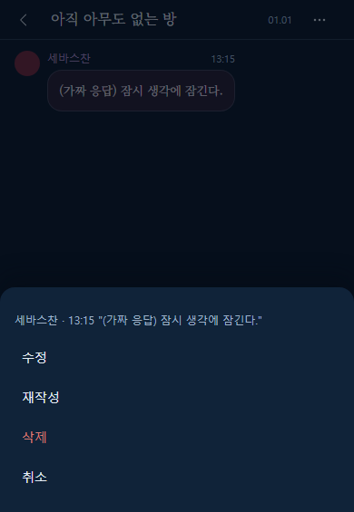

# 대화 화면 사용 매뉴얼

## 1. 개요

대화 화면은 방 하나의 대화를 메신저처럼 보여 줍니다. 세바스찬과 시엘의 말, 회원의 말, 장면 지시가 말풍선으로 차례대로 나옵니다.

이 화면은 누가 보느냐에 따라 달라집니다.

| 보는 사람 | 지금 할 수 있는 것 |
|---|---|
| 로그인한 회원 중 등급이 되는 분 | 패널을 열면 자동으로 쓰기가 가능합니다. 발화와 지시 쓰기, 세바스찬·시엘 버튼으로 대사 만들기, 말풍선 수정·재작성·삭제, 방 이름 변경·삭제를 할 수 있습니다. |
| 그 외 방문자 | 대화를 읽고, 위로 올려 지난 대화를 볼 수 있습니다. 맨 아래에 "열람 전용 - 대화 참여는 등급 회원만" 안내가 보이는 것이 정상입니다. |

**회원 화면(쓰기 가능)**

**방문자 화면(열람 전용)**

## 2. 진입 경로

1. 갠홈 헤더의 말풍선 버튼을 눌러 오른쪽 패널을 엽니다.
2. 방 목록에서 보고 싶은 방을 누릅니다(회원은 「+ 새 방」으로 만든 직후 바로 들어옵니다).
3. 대화 화면이 열립니다. 가장 최근 대화가 맨 아래에 보입니다.

마지막으로 보던 방이 있으면 패널을 열 때 바로 이 화면이 열릴 수 있습니다.

## 3. 화면 구성

- **맨 위 줄** : 왼쪽 ‹ 버튼(방 목록으로 돌아가기), 가운데 방 이름, 날짜(방을 만든 날, 월.일). 회원에게는 오른쪽 끝에 ⋯ 버튼(방 메뉴)이 있습니다. 화면 폭이 아주 좁으면 날짜는 숨겨집니다.
- **대화 영역** : 가운데 넓은 부분입니다. 위아래로 밀어 볼 수 있습니다.
- **맨 아래 줄** : 회원에게는 「세바스찬」「시엘」 버튼, 입력창, 「OOC 끔/켬」 스위치, 「전송」 버튼이 있습니다. 방문자에게는 열람 전용 안내만 있습니다.

### 말풍선 읽는 법

| 누구의 말 | 모양 |
|---|---|
| 세바스찬 | **왼쪽**. 동그란 사진, 이름, 시각과 함께 나옵니다. |
| 시엘 | **오른쪽**. 사진과 이름이 오른쪽에 붙고, 말풍선 색이 세바스찬과 다릅니다. |
| 참여한 회원의 발화 | **가운데** 말풍선. 위에 작성자 이름이 나옵니다. 이름이 없으면 "이름 없음"입니다. |
| 지시(OOC) | **가운데** 회색 한 줄. "— [지시] 내용 —" 모양이고 시각이 붙습니다. |

## 4. 기능별 사용법

### 4.1 대화 읽기
처음에는 가장 최근 대화가 나오고 맨 아래에서 시작합니다. 위로 밀면 이전 말들이 보입니다.

### 4.2 이전 대화 보기
대화 영역을 위로 밀어 맨 위 가까이에 닿으면 "이전 대화 불러오는 중"이 잠깐 나오고, 더 오래된 대화가 위에 이어 붙습니다. 읽던 자리는 그대로 유지됩니다. 더 불러올 대화가 없으면 아무 일도 일어나지 않습니다.

### 4.3 뒤로 가기
왼쪽 위 ‹ 버튼을 누르면 방 목록으로 돌아갑니다.

### 4.4 읽던 자리 기억
방을 나갔다가 다시 열면 보던 위치 근처로 돌아옵니다. 이 기억은 사용하는 기기에만 남습니다.

### 4.5 발화 쓰기 (등급 회원)
1. 맨 아래 입력창("대사나 지시를 입력")에 내용을 적습니다. **1~2000자**입니다.
2. 「OOC」 스위치는 **끔** 상태로 둡니다.
3. 「전송」을 누르거나 Enter를 누릅니다. 줄을 바꾸려면 Shift+Enter를 누릅니다.
4. 내 말이 가운데 말풍선으로 대화에 붙고, 맨 아래로 이동합니다.

### 4.6 지시(OOC) 쓰기 (등급 회원)
장면에 대한 지시나 메모는 말풍선 대신 지시로 남깁니다.
1. 「OOC」 스위치를 눌러 **켬**으로 바꿉니다.
2. 내용을 적고 「전송」을 누릅니다.
3. 대화에 가운데 회색 한 줄 "— [지시] 내용 —"로 표시됩니다.

### 4.7 말풍선 수정·삭제 (등급 회원)
내 글과 다른 사람의 글 모두 같은 방법으로 고치거나 지울 수 있습니다.
1. 고치고 싶은 말풍선을 **길게 누릅니다**(컴퓨터에서는 **오른쪽 클릭**).
2. 이름·시각·내용 일부가 적힌 메뉴가 열립니다. 「수정」 또는 「삭제」를 고릅니다(마지막 캐릭터 대사에는 「재작성」도 있습니다. 4.11 참고).
3. **수정** : 말풍선이 입력칸으로 바뀝니다. 고친 뒤 「저장」, 그만두려면 「취소」를 누릅니다.
4. **삭제** : "이 메시지를 삭제할까요? 삭제한 메시지는 되돌릴 수 없습니다." 확인창이 나옵니다. 「삭제」를 누르면 지워지고 「취소」를 누르면 그대로입니다.

### 4.8 방 이름 변경·방 삭제 (등급 회원)
1. 맨 위 오른쪽 ⋯ 버튼을 누르면 "방 메뉴" 창이 열립니다.
2. **이름 변경** : 「이름 변경」을 고르고 새 이름(1~60자)을 적어 확인합니다.
3. **방 삭제** : 「방 삭제」를 고르면 "이 방을 삭제할까요? 메시지와 장기기억이 함께 지워지며 되돌릴 수 없습니다." 확인창이 나옵니다. 「삭제」를 누르면 방과 모든 메시지가 지워지고 방 목록으로 돌아갑니다.

### 4.9 세바스찬·시엘 버튼으로 대사 만들기 (등급 회원)
입력창 위쪽에 「세바스찬」「시엘」 버튼이 있습니다. 누르면 그 캐릭터가 지금까지의 대화를 보고 **한 번 말합니다.**

1. 말하게 하고 싶은 캐릭터 버튼을 한 번 누릅니다.
2. 대화 맨 아래에 그 캐릭터 쪽(세바스찬은 왼쪽, 시엘은 오른쪽)으로 "…" 말풍선이 먼저 나타납니다. 대사를 만드는 중이라는 뜻입니다.
3. 두 버튼과 「전송」은 잠시 눌리지 않고, ⋯ 버튼도 쓸 수 없습니다. 입력창에 글을 미리 적어 두는 것은 됩니다.
4. 보통 몇 초, 길어도 약 1분 안에 "…"가 완성된 대사로 바뀌고 버튼이 다시 켜집니다.

- 같은 캐릭터를 연달아 눌러 계속 말하게 할 수도 있고, 다른 캐릭터를 번갈아 눌러도 됩니다.
- 대사가 생기면 맨 아래 근처를 보고 있던 경우 자동으로 맨 아래로 이동합니다. 위쪽의 지난 대화를 읽고 있었다면 위치는 그대로 두고 「새 메시지」 안내가 나옵니다.
- 입력창에 쓴 말은 캐릭터 버튼으로는 전달되지 않습니다. 지시나 발화는 「전송」으로 먼저 남기세요.
- 말풍선 수정 중에는 캐릭터 버튼이 눌리지 않습니다. 수정을 저장하거나 취소한 뒤에 누르세요.
- 열람 전용 화면(방문자)에는 이 버튼이 없습니다.

### 4.10 대사 만들기가 실패했을 때
실패하면 "…" 말풍선 자리에 붉은 테두리의 안내 말풍선과 「재시도」 버튼이 나타납니다.

| 화면에 나오는 글 | 뜻 | 하실 일 |
|---|---|---|
| 이 방에서 이미 대사를 만들고 있습니다. 잠시 후 다시 시도해 주세요. | 다른 사람(또는 다른 창)이 같은 방에서 대사를 만드는 중입니다. | 몇 초 기다렸다가 「재시도」를 누릅니다. |
| 생성에 실패했습니다. | 대사를 만들지 못했습니다. 저장된 것은 없습니다. | 「재시도」를 누릅니다. 계속되면 잠시 뒤 다시 해 보세요. |
| 서버 설정이 올바르지 않습니다. 관리자에게 알려 주세요. | 운영 쪽 설정 문제입니다. 내가 고칠 수 없습니다. | 운영자에게 알립니다. 고쳐진 뒤 「재시도」를 누르면 됩니다. 읽기와 발화 쓰기는 계속 됩니다. |
| 요청이 너무 많습니다. N초 후 다시 시도해 주세요. | 너무 자주 눌렀습니다. | 안내된 시간만큼 기다린 뒤 「재시도」를 누릅니다. |
| 서버에 연결할 수 없습니다. | 인터넷 연결 문제입니다. | 연결을 확인하고 「재시도」를 누릅니다. 아래 주의를 읽어 주세요. |

- **「재시도」** 는 같은 캐릭터로 처음부터 다시 만듭니다. 대신 다른 캐릭터 버튼을 누르면 실패 안내는 사라지고 그 캐릭터의 새 대사를 만듭니다.
- 실패 안내가 있는 채로 ‹ 버튼으로 나가면 실패 안내는 사라집니다. 저장된 것은 없습니다.
- 등급이 맞지 않거나 로그인이 풀린 경우에는 실패 말풍선 대신 "대화 참여 등급이 아니어서 열람 전용으로 바뀌었습니다." 같은 안내가 뜨며 **열람 전용**으로 바뀝니다(4.12 참고). 방이 지워졌다면 방 목록으로 돌아갑니다.
- 연결이 끊겨 응답이 끝내 오지 않으면 "…"가 계속 남을 수 있습니다. ‹ 버튼으로 나갔다 다시 들어오거나 새로 고쳐 주세요.

### 4.11 재작성 — 마지막 대사 다시 만들기 (등급 회원)
마음에 들지 않는 캐릭터의 **가장 마지막 대사**를 같은 자리에서 새 대사로 바꿉니다.

1. 화면 맨 아래에 있는 캐릭터(세바스찬·시엘)의 말풍선을 **길게 누릅니다**(컴퓨터에서는 **오른쪽 클릭**).
2. 메뉴에서 「재작성」을 고릅니다. 확인창 없이 바로 시작됩니다.

3. 그 말풍선에 "다시 쓰는 중…"이 나오고 기존 글이 흐리게 보입니다. 두 캐릭터 버튼과 「전송」은 잠시 쓸 수 없습니다.
4. 끝나면 같은 말풍선의 글이 새 대사로 바뀝니다.

- 「재작성」은 **대화 맨 마지막이 캐릭터 대사일 때, 그 대사에만** 보입니다. 내 발화·지시나 이미 뒤에 다른 말이 이어진 대사에는 없습니다.
- 재작성이 실패하면 원래 대사가 그대로 남고 안내 문구가 잠깐 뜹니다("대사를 다시 만들지 못했습니다. 메뉴에서 다시 시도해 주세요."). 「재시도」 버튼은 없으니 메뉴에서 「재작성」을 다시 고르세요.
- 그 사이 다른 사람이 말을 이어 놓았다면 "다른 메시지가 먼저 이어져 재작성할 수 없습니다. 대화를 새로 불러옵니다."가 나오고 대화가 새로 불러와집니다.

### 4.12 열람 전용 화면에서는
방문자(또는 등급이 맞지 않는 분)에게는 「세바스찬」「시엘」 버튼과 입력창이 없고, 말풍선 메뉴(수정·재작성·삭제)도 열리지 않습니다. 맨 아래에 "열람 전용 - 대화 참여는 등급 회원만"만 보입니다. 대사 만들기 도중 로그인이 풀리거나 등급이 맞지 않으면 안내가 뜨고 이 화면으로 바뀝니다.

### 4.13 안내 메시지
쓰다가 문제가 생기면 화면에 짧은 안내가 나옵니다.

| 상황 | 안내 |
|---|---|
| 너무 자주 씀 | 요청이 너무 많습니다. N초 후 다시 시도해 주세요. 잠시 기다린 뒤 다시 보내세요. |
| 글자 수가 맞지 않음 | 메시지는 1~2000자로 입력해 주세요. / 방 제목은 1~60자로 입력해 주세요. |
| 수정하려던 글이 이미 지워짐 | 메시지를 찾을 수 없습니다. 이미 삭제되었을 수 있습니다. |
| 방이 지워짐 | 방을 찾을 수 없습니다. 목록으로 돌아가 주세요. |
| 연결 문제 | 서버에 연결할 수 없습니다. |
| 로그인이 풀림 | 로그인 정보가 없어 열람 전용으로 바뀌었습니다. / 인증이 만료되어 열람 전용으로 바뀌었습니다. 새로 고쳐 주세요. |
| 등급이 맞지 않음 | 대화 참여 등급이 아니어서 열람 전용으로 바뀌었습니다. |

로그인 관련 안내가 나오면 입력창과 ⋯가 사라지고 **열람 전용**으로 바뀝니다. 갠홈에서 다시 로그인하고 패널을 새로 열면 쓰기가 돌아옵니다.

### 4.14 상태별 화면

| 상황 | 화면에 나오는 글 | 하실 일 |
|---|---|---|
| 처음 불러오는 중 | 대화를 불러오는 중 | 잠시 기다립니다. |
| 대화가 하나도 없음 | 아직 대화가 없습니다 | 회원은 입력창으로 첫 말을 남길 수 있습니다. |
| 처음 불러오기 실패 | 대화를 불러오지 못했습니다 + 이유 + 「다시 시도」 | 「다시 시도」를 누릅니다. 뒤로 가기는 언제나 됩니다. |
| 이전 대화 불러오는 중 | 이전 대화 불러오는 중 | 잠시 기다립니다. |
| 이전 대화 불러오기 실패 | 이전 대화를 불러오지 못했습니다 + 「다시 시도」 | 버튼을 누릅니다. 이미 보이는 대화는 그대로입니다. |

방이 그 사이 지워졌다면 "방을 찾을 수 없습니다. 목록으로 돌아가 주세요."가 나옵니다. ‹ 버튼으로 목록에 돌아가세요.

## 5. 주의사항

- 대화에 참여할 수 있는 등급은 운영자가 정합니다.
- 삭제한 말풍선과 방은 **되돌릴 수 없습니다.** 방을 지우면 안의 메시지도 함께 지워집니다.
- 다른 사람의 글도 수정·삭제할 수 있으니 신중하게 다뤄 주세요.
- 너무 자주 쓰면 잠시 기다리라는 안내가 나옵니다.
- 이전 대화는 위로 밀 때 자동으로 불러옵니다. 실패하면 자동으로 다시 시도하지 않으니 「다시 시도」를 눌러야 합니다.
- 말풍선 글은 그대로 글자로만 보입니다.

## 6. FAQ

**Q. 왜 입력창이 없나요?**
로그인한 회원 중 등급이 되는 분께만 보입니다. 방문자는 열람만 가능합니다. 로그인이 풀려도 입력창이 사라집니다.

**Q. 세바스찬·시엘 버튼이 안 보여요.**
로그인한 회원 중 등급이 되는 분께만 보입니다. 로그인이 풀렸거나 등급이 맞지 않으면 열람 전용이 되어 사라집니다. 갠홈에서 로그인을 확인하고 패널을 새로 열어 보세요. 버튼이 보이는데 눌리지 않으면 대사를 만드는 중이거나 말풍선을 수정하는 중입니다.

**Q. 「재작성」이 메뉴에 없어요.**
화면 맨 아래의 캐릭터 대사에만 나옵니다. 내 글, 지시, 뒤에 다른 말이 이어진 대사에는 없습니다.

**Q. "…"가 안 사라져요.**
대사를 만드는 데 시간이 걸립니다. 보통 몇 초, 길어도 약 1분입니다. 그래도 그대로면 ‹로 나갔다 다시 들어오거나 새로 고쳐 주세요.

**Q. 대사가 두 번 생겼어요.**
"서버에 연결할 수 없습니다."가 뜬 뒤 「재시도」를 누르면, 첫 번째 대사가 실제로는 저장돼 있어 두 개가 될 수 있습니다. 필요 없는 쪽은 말풍선을 길게 눌러 「삭제」하세요.

**Q. "서버 설정이 올바르지 않습니다"가 떠요.**
운영 쪽 문제입니다. 운영자에게 알려 주세요.

**Q. 글자 수 제한이 있나요?**
말풍선·지시는 1~2000자, 방 이름은 1~60자입니다.

**Q. 지운 메시지를 되살릴 수 있나요?**
아니요. 삭제는 되돌릴 수 없습니다.

**Q. 오래된 대화는 어떻게 보나요?**
대화 영역을 위로 계속 밀면 이전 대화가 이어서 나옵니다.

**Q. 새로고침하면 어디로 가나요?**
방을 열어 둔 채였다면 그 방으로, 목록으로 돌아온 뒤였다면 목록으로 갑니다.

**Q. 오른쪽 위 날짜는 무슨 날짜인가요?**
방을 만든 날입니다. 목록의 날짜(마지막 갱신일)와 다를 수 있습니다.

**Q. 대화가 안 나오고 오류가 떠요.**
「다시 시도」를 눌러 보세요. 계속되면 인터넷 연결을 확인하고 잠시 뒤 다시 열어 보세요.

## 7. 준비 중인 기능

아래는 아직 사용할 수 없습니다.

- 방의 장기기억 보기

## 8. 관련 화면

- 방 목록 화면: `ui/src/rooms/manual.md`

## 9. 변경 이력

| 날짜 | 내용 |
|---|---|
| 2026-10-06 | S3 반영: 세바스찬·시엘 버튼으로 대사 만들기, 생성 중 표시, 실패와 재시도, 재작성(4.9~4.12), FAQ 보강. 장기기억만 준비 중으로 남김 |
