# 대화 화면 사용 매뉴얼

## 1. 개요

대화 화면은 방 하나의 대화를 메신저처럼 보여 줍니다. 세바스찬과 시엘의 말, 회원의 말, 장면 지시가 말풍선으로 차례대로 나옵니다.

이 화면은 누가 보느냐에 따라 달라집니다.

| 보는 사람 | 지금 할 수 있는 것 |
|---|---|
| 로그인한 회원 중 등급이 되는 분 | 패널을 열면 자동으로 쓰기가 가능합니다. 발화와 지시 쓰기(전송하면 세바스찬·시엘 중 한 명이 알아서 답합니다), 세바스찬·시엘 버튼으로 말할 캐릭터 지정하기, 말풍선 아래 버튼으로 수정·재작성·삭제, 방 이름 변경·삭제, 장기기억 보기와 고치기, 방 비밀번호 잠금(걸기·바꾸기·풀기)을 할 수 있습니다. |
| 그 외 방문자 | 대화를 읽고, 위로 올려 지난 대화를 볼 수 있습니다. 맨 아래에 "열람 전용 - 대화 참여는 등급 회원만" 안내가 보이는 것이 정상입니다. |

**회원 화면(쓰기 가능)**

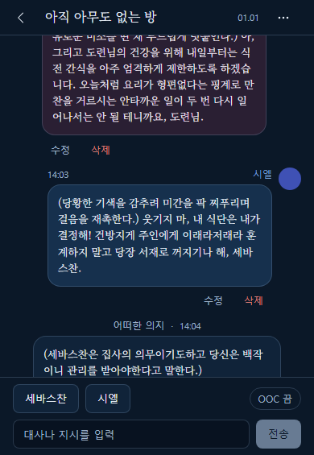

**방문자 화면(열람 전용)**

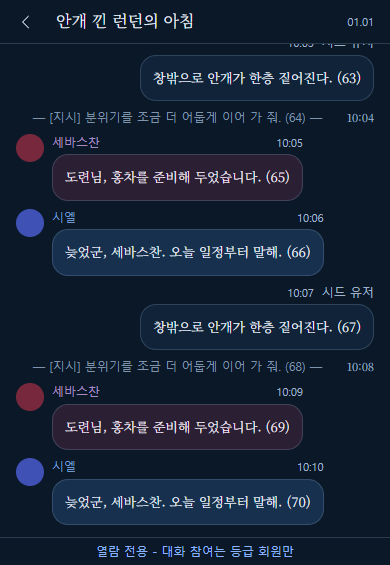

## 2. 진입 경로

1. 갠홈 헤더의 말풍선 버튼을 눌러 오른쪽 패널을 엽니다.
2. 방 목록에서 보고 싶은 방을 누릅니다(회원은 「+ 새 방」으로 만든 직후 바로 들어옵니다).
3. 대화 화면이 열립니다. 가장 최근 대화가 맨 아래에 보입니다.

마지막으로 보던 방이 있으면 패널을 열 때 바로 이 화면이 열릴 수 있습니다.

## 3. 화면 구성

- **맨 위 줄** : 왼쪽 ‹ 버튼(방 목록으로 돌아가기), 가운데 방 이름, 날짜(방을 만든 날, 월.일). 회원에게는 오른쪽 끝에 ⋯ 버튼(방 메뉴)이 있습니다. 화면 폭이 아주 좁으면 날짜는 숨겨집니다.
- **대화 영역** : 가운데 넓은 부분입니다. 위아래로 밀어 볼 수 있습니다. 회원에게는 말풍선마다 바로 아래에 「수정」「삭제」 버튼 줄이 보입니다(4.7 참고).
- **맨 아래 줄** : 회원에게는 「세바스찬」「시엘」 버튼, 입력창, 「OOC 끔/켬」 스위치, 「전송」 버튼이 있습니다. 방문자에게는 열람 전용 안내만 있습니다.

### 말풍선 읽는 법

| 누구의 말 | 모양 |
|---|---|
| 세바스찬 | **왼쪽**. 동그란 사진, 이름, 시각과 함께 나옵니다. |
| 시엘 | **오른쪽**. 사진과 이름이 오른쪽에 붙고, 말풍선 색이 세바스찬과 다릅니다. |
| 참여한 회원의 발화 | **가운데** 말풍선. 위에 작성자 이름이 나오는데, 누가 썼든 **「어떠한 의지」** 로 보입니다. |
| 지시(OOC) | **가운데** 회색 한 줄. "— [지시] 내용 —" 모양이고 시각이 붙습니다. |

## 4. 기능별 사용법

### 4.1 대화 읽기
처음에는 가장 최근 대화가 나오고 맨 아래에서 시작합니다. 위로 밀면 이전 말들이 보입니다.

### 4.2 이전 대화 보기
대화 영역을 위로 밀어 맨 위 가까이에 닿으면 "이전 대화 불러오는 중"이 잠깐 나오고, 더 오래된 대화가 위에 이어 붙습니다. 읽던 자리는 그대로 유지됩니다. 더 불러올 대화가 없으면 아무 일도 일어나지 않습니다.

### 4.3 뒤로 가기
왼쪽 위 ‹ 버튼을 누르면 방 목록으로 돌아갑니다.

### 4.4 읽던 자리 기억
방을 나갔다가 다시 열면 보던 위치 근처로 돌아옵니다. 이 기억은 사용하는 기기에만 남습니다.

### 4.5 발화 쓰기 — 전송하면 캐릭터가 알아서 답해요 (등급 회원)
1. 맨 아래 입력창("대사나 지시를 입력")에 내용을 적습니다. **1~2000자**입니다.
2. 「OOC」 스위치는 **끔** 상태로 둡니다.
3. 「전송」을 누르거나 Enter를 누릅니다. 줄을 바꾸려면 Shift+Enter를 누릅니다.
4. 내 말이 가운데 말풍선으로 대화에 붙고, 입력창은 비워집니다.
5. 곧바로 가운데에 **"…" 말풍선**이 나옵니다. 세바스찬이나 시엘이 답을 만드는 중이라는 뜻입니다.
6. 보통 10~30초 뒤에 "…"가 그 캐릭터의 대사로 바뀝니다. 세바스찬은 왼쪽, 시엘은 오른쪽에 나옵니다.

**답을 만드는 중 (가운데 "…")**

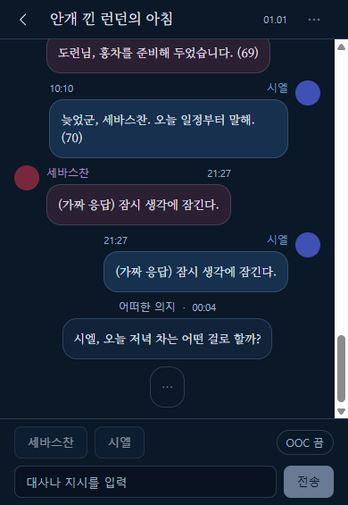

**답이 온 모습**

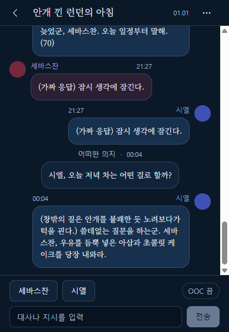

**누가 답하나요?** 세 가지 순서로 정해집니다.
1. 내 글에 「세바스찬」 또는 「시엘」 중 **한쪽 이름만** 있으면 그 캐릭터가 답합니다.
2. 이름이 없거나 둘 다 있으면 AI가 대화를 보고 한 명을 고릅니다.
3. AI가 고르지 못하면 **직전에 말하지 않은 캐릭터**가 답합니다. 캐릭터의 말이 아직 하나도 없으면 세바스찬입니다.

**원하는 캐릭터를 말하게 하려면**
- 글 안에 이름을 넣으세요. 예: "시엘, 오늘 저녁 차는 어떤 걸로 할까?"
- 또는 글을 보내지 않고 입력창 위의 「세바스찬」「시엘」 버튼을 누르세요(4.9 참고). 이 버튼은 입력창의 글과 상관없이 그 캐릭터를 바로 말하게 합니다.

**작성자 이름은 「어떠한 의지」** 
내 글은 누가 썼든 말풍선 위에 「어떠한 의지」로 나옵니다. 내 이름이 보이지 않아도 정상입니다.

**답을 만드는 동안에는 잠겨요**
- 「전송」, 「세바스찬」「시엘」 버튼, ⋯ 버튼이 눌리지 않습니다. 끼어들어 한 번 더 보낼 수 없습니다.
- 말풍선 아래의 「수정」「재작성」「삭제」 버튼도 흐려져 눌리지 않습니다.
- 말풍선 수정 중이었다면 수정 칸은 열려 있지만 「저장」이 눌리지 않습니다. 「취소」는 됩니다. 답이 오면 「저장」이 다시 켜집니다.
- 입력창에 다음 글을 미리 적어 두는 것은 됩니다.

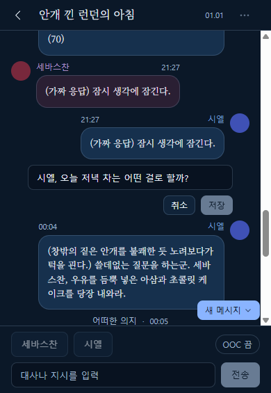

답을 만들지 못하면 같은 자리에 오류와 「재시도」가 나옵니다(4.10 참고). 내 글은 이미 저장되어 있으니 다시 쓰지 않아도 됩니다.

### 4.6 지시(OOC) 쓰기 (등급 회원)
장면에 대한 지시나 메모는 말풍선 대신 지시로 남깁니다.
1. 「OOC」 스위치를 눌러 **켬**으로 바꿉니다.
2. 내용을 적고 「전송」을 누릅니다.
3. 대화에 가운데 회색 한 줄 "— [지시] 내용 —"로 표시됩니다.
4. 지시도 발화와 똑같이 곧바로 세바스찬이나 시엘이 답합니다(4.5 참고).

### 4.7 말풍선 수정·삭제 (등급 회원)
회원에게는 **말풍선 바로 아래에 「수정」「삭제」 버튼이 항상 보입니다.** 길게 누르거나 오른쪽 클릭을 할 필요가 없습니다. 내 글과 다른 사람의 글 모두 같은 방법으로 고치거나 지울 수 있습니다. 대화 맨 마지막이 캐릭터 대사라면 그 대사에는 「재작성」도 함께 보입니다(4.11 참고).

버튼 줄은 말풍선이 있는 쪽에 붙습니다. 세바스찬은 왼쪽, 시엘은 오른쪽, 회원의 발화와 지시는 가운데입니다. 답을 만드는 중인 "…" 말풍선과 실패 안내 말풍선에는 버튼이 없습니다.

**수정**
1. 고치고 싶은 말풍선 아래의 「수정」을 누릅니다.
2. 말풍선이 입력칸으로 바뀌고 그 말풍선의 버튼 줄은 사라집니다.
3. 내용을 고친 뒤 「저장」을 누릅니다. 그만두려면 「취소」를 누릅니다.

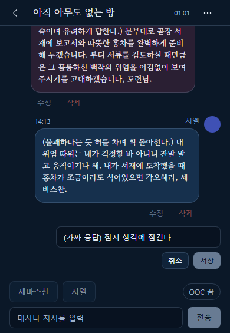

수정하는 동안에는 다른 말풍선의 버튼과 세바스찬·시엘 버튼, 「전송」이 잠시 눌리지 않습니다. 저장하거나 취소하면 다시 쓸 수 있습니다.

**삭제**
1. 지우고 싶은 말풍선 아래의 「삭제」를 누릅니다.
2. "이 메시지를 삭제할까요? 삭제한 메시지는 되돌릴 수 없습니다." 확인창이 아래쪽에 나옵니다.
3. 「삭제」를 누르면 지워지고 「취소」를 누르면 그대로입니다.

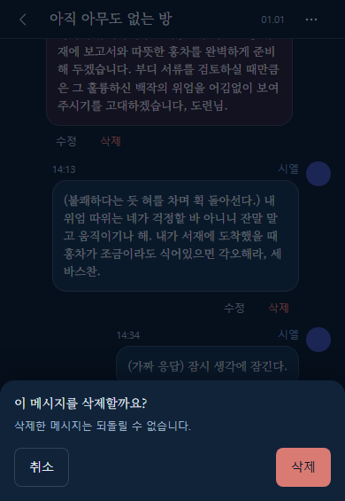

**버튼이 흐려져 눌리지 않을 때**
다른 작업이 진행 중이라는 뜻입니다. 전송 저장 중, 대사를 만드는 중, 다른 말풍선을 수정하는 중, 방 이름을 바꾸거나 방을 지우는 중에 그렇습니다. 끝나면 다시 눌립니다.

### 4.8 방 이름 변경·방 삭제 (등급 회원)
1. 맨 위 오른쪽 ⋯ 버튼을 누르면 "방 메뉴" 창이 열립니다. 항목은 위에서부터 「이름 변경」「장기기억」「잠금」「방 삭제」「취소」 순서입니다.
2. **이름 변경** : 「이름 변경」을 고르고 새 이름(1~60자)을 적어 확인합니다.
3. **장기기억** : 「장기기억」을 고르면 지난 줄거리 요약이 열립니다(4.15 참고).
   **잠금** : 「잠금」을 고르면 방에 비밀번호를 걸거나 바꾸거나 풀 수 있습니다(4.16 참고).
4. **방 삭제** : 「방 삭제」를 고르면 "이 방을 삭제할까요? 메시지와 장기기억이 함께 지워지며 되돌릴 수 없습니다." 확인창이 나옵니다. 「삭제」를 누르면 방과 모든 메시지가 지워지고 방 목록으로 돌아갑니다.

### 4.9 세바스찬·시엘 버튼으로 대사 만들기 (등급 회원)
입력창 위쪽에 「세바스찬」「시엘」 버튼이 있습니다. 누르면 그 캐릭터가 지금까지의 대화를 보고 **한 번 말합니다.**

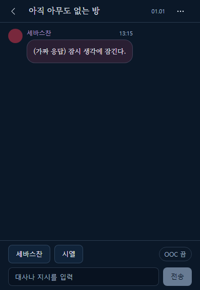

1. 말하게 하고 싶은 캐릭터 버튼을 한 번 누릅니다.
2. 대화 맨 아래에 그 캐릭터 쪽(세바스찬은 왼쪽, 시엘은 오른쪽)으로 "…" 말풍선이 먼저 나타납니다. 대사를 만드는 중이라는 뜻입니다.
3. 두 버튼과 「전송」은 잠시 눌리지 않고, ⋯ 버튼과 말풍선 아래 「수정」「재작성」「삭제」 버튼도 쓸 수 없습니다. 말풍선 수정 중이라면 「저장」도 잠깁니다. 입력창에 글을 미리 적어 두는 것은 됩니다.
4. 보통 10~30초, 길어도 약 1분 안에 "…"가 완성된 대사로 바뀌고 버튼이 다시 켜집니다.

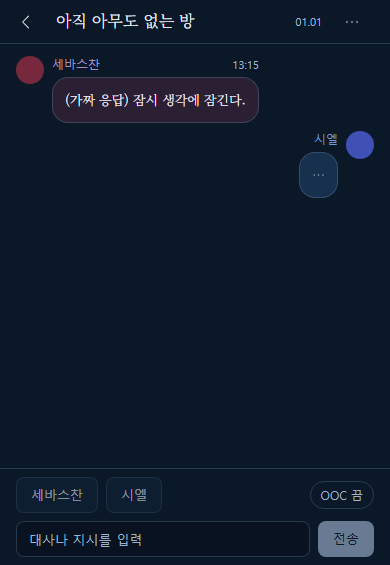

- 같은 캐릭터를 연달아 눌러 계속 말하게 할 수도 있고, 다른 캐릭터를 번갈아 눌러도 됩니다.
- 대사가 생기면 맨 아래 근처를 보고 있던 경우 자동으로 맨 아래로 이동합니다. 위쪽의 지난 대화를 읽고 있었다면 위치는 그대로 두고 「새 메시지」 안내가 나옵니다.
- 이 버튼은 **누가 말할지 직접 정할 때** 씁니다. 입력창의 글은 전달되지 않습니다. 글을 남기면서 답을 받으려면 「전송」을 쓰세요(4.5 참고).
- 말풍선을 수정하는 중에는 캐릭터 버튼이 눌리지 않습니다. 수정을 저장하거나 취소한 뒤에 누르세요.
- 열람 전용 화면(방문자)에는 이 버튼이 없습니다.

### 4.10 대사 만들기가 실패했을 때
실패하면 "…" 말풍선 자리에 붉은 테두리의 안내 말풍선과 「재시도」 버튼이 나타납니다. 「전송」 뒤의 자동 답이 실패했을 때도 가운데에 같은 모양으로 나옵니다.

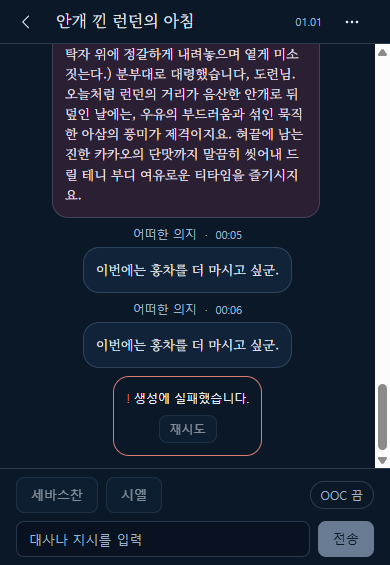

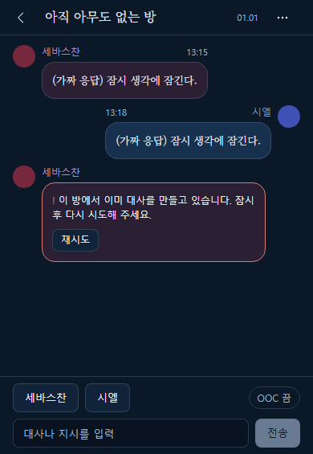

| 화면에 나오는 글 | 뜻 | 하실 일 |
|---|---|---|
| 이 방에서 이미 대사를 만들고 있습니다. 잠시 후 다시 시도해 주세요. | 다른 사람(또는 다른 창)이 같은 방에서 대사를 만드는 중입니다. | 몇 초 기다렸다가 「재시도」를 누릅니다. |
| 생성에 실패했습니다. | 대사를 만들지 못했습니다. 저장된 것은 없습니다. | 「재시도」를 누릅니다. 계속되면 잠시 뒤 다시 해 보세요. |
| 서버 설정이 올바르지 않습니다. 관리자에게 알려 주세요. | 운영 쪽 설정 문제입니다. 내가 고칠 수 없습니다. | 운영자에게 알립니다. 고쳐진 뒤 「재시도」를 누르면 됩니다. 읽기와 발화 쓰기는 계속 됩니다. |
| 요청이 너무 많습니다. N초 후 다시 시도해 주세요. | 너무 자주 눌렀습니다. | 안내된 시간만큼 기다린 뒤 「재시도」를 누릅니다. |
| 이번 달 AI 사용 한도에 닿았습니다. 다음 달에 다시 시도해 주세요. | 이번 달 쓸 수 있는 양을 다 썼습니다. | 다음 달에 다시 시도합니다. 운영자에게 알려도 좋습니다. |
| 서버에 연결할 수 없습니다. | 인터넷 연결 문제입니다. | 연결을 확인하고 「재시도」를 누릅니다. 아래 주의를 읽어 주세요. |

- **「재시도」** 는 처음부터 다시 만듭니다. 캐릭터 버튼으로 만들던 중이었다면 같은 캐릭터로, 「전송」 뒤의 자동 답이었다면 누가 답할지부터 다시 정합니다. 내 글은 다시 저장되지 않습니다. 대신 다른 캐릭터 버튼을 누르면 실패 안내는 사라지고 그 캐릭터의 새 대사를 만듭니다.
- 실패 안내가 있는 채로 ‹ 버튼으로 나가면 실패 안내는 사라집니다. 저장된 것은 없습니다.
- 등급이 맞지 않거나 로그인이 풀린 경우에는 실패 말풍선 대신 "대화 참여 등급이 아니어서 열람 전용으로 바뀌었습니다." 같은 안내가 뜨며 **열람 전용**으로 바뀝니다(4.12 참고). 방이 지워졌다면 방 목록으로 돌아갑니다.
- 연결이 끊겨 응답이 끝내 오지 않으면 "…"가 계속 남을 수 있습니다. ‹ 버튼으로 나갔다 다시 들어오거나 새로 고쳐 주세요.

### 4.11 재작성 — 마지막 대사 다시 만들기 (등급 회원)
마음에 들지 않는 캐릭터의 **가장 마지막 대사**를 같은 자리에서 새 대사로 바꿉니다.

1. 화면 맨 아래에 있는 캐릭터(세바스찬·시엘)의 말풍선 아래에서 「재작성」을 누릅니다. 「수정」과 「삭제」 사이에 있습니다. 확인창 없이 바로 시작됩니다.
2. 그 말풍선에 "다시 쓰는 중…"이 나오고 기존 글이 흐리게 보입니다. 버튼들과 「전송」은 잠시 쓸 수 없습니다.

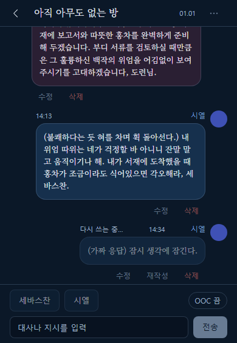

3. 끝나면 같은 말풍선의 글이 새 대사로 바뀌고 버튼이 다시 켜집니다.

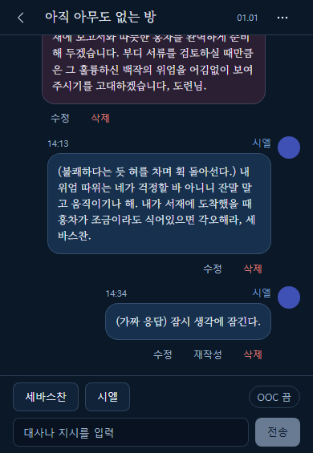

- 「재작성」은 **대화 맨 마지막이 캐릭터 대사일 때, 그 대사에만** 보입니다. 내 발화·지시나 이미 뒤에 다른 말이 이어진 대사에는 없습니다.
- 재작성이 실패하면 원래 대사가 그대로 남고 안내 문구가 잠깐 뜹니다("대사를 다시 만들지 못했습니다. 재작성을 다시 눌러 주세요."). 「재시도」 버튼은 없으니 「재작성」을 다시 누르세요.
- 그 사이 다른 사람이 말을 이어 놓았다면 "다른 메시지가 먼저 이어져 재작성할 수 없습니다. 대화를 새로 불러옵니다."가 나오고 대화가 새로 불러와집니다.

### 4.12 열람 전용 화면에서는
방문자(또는 등급이 맞지 않는 분)에게는 「세바스찬」「시엘」 버튼과 입력창이 없고, 말풍선 아래의 「수정」「재작성」「삭제」 버튼도 없습니다. 맨 아래에 "열람 전용 - 대화 참여는 등급 회원만"만 보입니다. 대사 만들기 도중 로그인이 풀리거나 등급이 맞지 않으면 안내가 뜨고 이 화면으로 바뀝니다.

### 4.13 안내 메시지
쓰다가 문제가 생기면 화면에 짧은 안내가 나옵니다.

| 상황 | 안내 |
|---|---|
| 너무 자주 씀 | 요청이 너무 많습니다. N초 후 다시 시도해 주세요. 잠시 기다린 뒤 다시 보내세요. |
| 글자 수가 맞지 않음 | 메시지는 1~2000자로 입력해 주세요. / 방 제목은 1~60자로 입력해 주세요. |
| 수정하려던 글이 이미 지워짐 | 메시지를 찾을 수 없습니다. 이미 삭제되었을 수 있습니다. |
| 방이 지워짐 | 방을 찾을 수 없습니다. 목록으로 돌아가 주세요. |
| 연결 문제 | 서버에 연결할 수 없습니다. |
| 로그인이 풀림 | 로그인 정보가 없어 열람 전용으로 바뀌었습니다. / 인증이 만료되어 열람 전용으로 바뀌었습니다. 새로 고쳐 주세요. |
| 등급이 맞지 않음 | 대화 참여 등급이 아니어서 열람 전용으로 바뀌었습니다. |

로그인 관련 안내가 나오면 입력창과 ⋯, 말풍선 아래 버튼이 사라지고 **열람 전용**으로 바뀝니다. 갠홈에서 다시 로그인하고 패널을 새로 열면 쓰기가 돌아옵니다.

### 4.14 상태별 화면

| 상황 | 화면에 나오는 글 | 하실 일 |
|---|---|---|
| 처음 불러오는 중 | 대화를 불러오는 중 | 잠시 기다립니다. |
| 대화가 하나도 없음 | 아직 대화가 없습니다 | 회원은 입력창으로 첫 말을 남길 수 있습니다. |
| 처음 불러오기 실패 | 대화를 불러오지 못했습니다 + 이유 + 「다시 시도」 | 「다시 시도」를 누릅니다. 뒤로 가기는 언제나 됩니다. |
| 이전 대화 불러오는 중 | 이전 대화 불러오는 중 | 잠시 기다립니다. |
| 이전 대화 불러오기 실패 | 이전 대화를 불러오지 못했습니다 + 「다시 시도」 | 버튼을 누릅니다. 이미 보이는 대화는 그대로입니다. |

방이 그 사이 지워졌다면 "방을 찾을 수 없습니다. 목록으로 돌아가 주세요."가 나옵니다. ‹ 버튼으로 목록에 돌아가세요.

### 4.15 장기기억 — 지난 줄거리 보기·고치기 (등급 회원)
대화가 길어지면 캐릭터가 오래된 대화를 다 기억하지 못합니다. 그래서 AI가 긴 대화를 요약해 **방마다 한 장의 "지난 줄거리" 쪽지**로 기억해 둡니다. 이 쪽지가 장기기억입니다. 마음에 들지 않으면 직접 고칠 수 있습니다. 이 기능은 로그인한 회원 중 등급이 되는 분께만 보입니다. 방문자에게는 ⋯ 버튼 자체가 없습니다.

**열기**
1. 대화 화면 맨 위 오른쪽 ⋯ 버튼을 누릅니다.
2. "방 메뉴" 창에서 「장기기억」을 누릅니다.

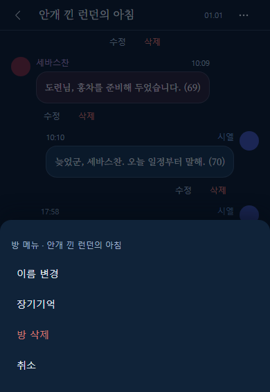

3. 아래쪽에 「장기기억」 창이 열립니다. 열 때마다 최신 내용을 새로 불러옵니다.

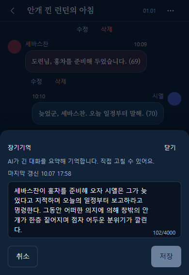

창에 보이는 것은 다음과 같습니다.
- **안내 글** : "AI가 긴 대화를 요약해 기억합니다. 직접 고칠 수 있어요."
- **마지막 갱신** : 요약이 마지막으로 바뀐 월.일 시각입니다. 아직 요약이 없으면 이 줄이 없고 입력칸에 "아직 요약이 없습니다"가 흐리게 보입니다.
- **입력칸과 글자 수** : 요약 글이 들어 있습니다. 오른쪽 아래에 "102/4000"처럼 글자 수가 보입니다. 최대 **4000자**입니다.
- 「취소」「저장」 버튼, 오른쪽 위 「닫기」 버튼.

불러오는 동안에는 "장기기억을 불러오는 중"이 보입니다. 불러오지 못하면 "장기기억을 불러오지 못했습니다"와 「다시 시도」가 나옵니다.

**고치기와 저장**
1. 입력칸을 눌러 내용을 고칩니다. Enter는 줄바꿈입니다.
2. 내용이 바뀌면 「저장」이 켜집니다. 바뀐 것이 없으면 「저장」은 흐리게 눌리지 않습니다.
3. 「저장」을 누르면 창이 닫히고 아래쪽에 "장기기억을 저장했습니다"가 잠깐 나옵니다.

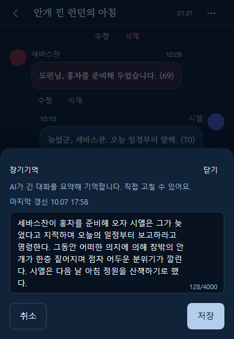

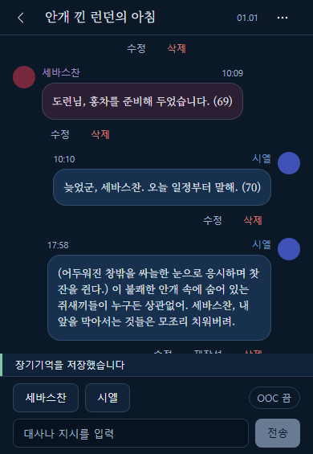

- 4000자를 넘으면 "4000자 이하로 줄여 주세요."가 나오고 「저장」이 눌리지 않습니다.
- 내용을 모두 지우고 저장하면 요약이 비워지고, **다음에 캐릭터가 말한 뒤 대화를 처음부터 다시 요약**합니다. 한 번에 최대 100개씩 요약하므로 대화가 아주 길면 몇 번에 나뉘어 채워집니다.
- 저장하는 동안에는 입력칸과 버튼이 잠시 잠기고 창이 닫히지 않습니다.
- 저장에 실패하면 창 안에 안내가 나오고 적은 내용은 그대로 남습니다. 다시 「저장」을 누르세요.

**고치다가 닫을 때**
내용을 고친 채 「닫기」「취소」를 누르거나 창 바깥을 누르면 "고친 내용을 버릴까요? 저장하지 않은 내용은 사라집니다."가 나옵니다. 「계속 고치기」는 창으로 돌아가고 「버리기」는 고친 내용을 버리고 닫습니다. 고친 것이 없으면 바로 닫힙니다.

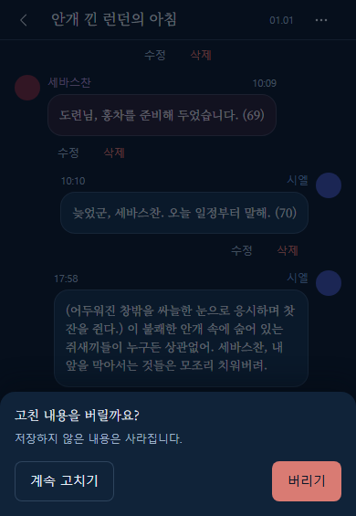

**요약은 언제 자동으로 만들어지나요?**
- 세바스찬이나 시엘이 말을 마친 뒤, 아직 요약하지 않은 대화가 **60개를 넘으면** AI가 오래된 부분을 요약해 기존 요약에 덧붙입니다.
- **최근 대화 40개는 요약하지 않고 그대로** 캐릭터가 읽습니다.
- 요약은 몇십 초 안에 뒤에서 조용히 이루어지며, 화면에는 아무 표시도 나오지 않습니다. 실패해도 대사에는 영향이 없고 다음 기회에 다시 시도합니다.
- 저장된 요약은 **다음 대사부터** 캐릭터가 참고합니다.

**함께 알아 두세요**
- 캐릭터가 방금 말한 직후에 창을 열면 아직 이전 요약일 수 있습니다. 잠시 뒤 다시 열어 보세요.
- 창을 열어 둔 사이에 자동 요약이 끝났더라도, 이어서 「저장」하면 **내가 저장한 내용이 우선**하여 자동 요약 결과를 대체합니다.
- 자동 요약이 진행되는 도중에 저장해도 내가 저장한 내용이 남습니다. 이후 대화가 더 쌓이면 내 요약 위에 새 줄거리가 덧붙습니다.

### 4.16 방 잠금 — 비밀번호 걸기·바꾸기·풀기 (등급 회원)
방에 비밀번호를 걸어 두면 비밀번호를 아는 사람만 이 방을 볼 수 있습니다. 갠홈 등급 2 이상 회원이 걸 수 있고, 갠홈 관리자는 비밀번호 없이 들어와 풀 수도 있습니다. 비밀번호는 서버에 원문으로 저장되지 않습니다.

**들어가는 길** : 갠홈 헤더의 말풍선 버튼 → 방 목록에서 방 누르기 → 맨 위 오른쪽 ⋯ → 「잠금」.

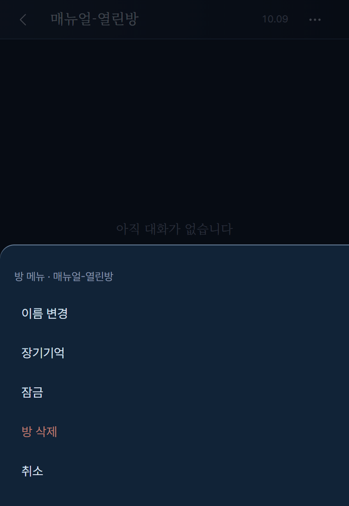

**걸기**
1. ⋯ 를 누르고 「잠금」을 고르면 "비밀번호 걸기" 창이 아래에서 올라옵니다. 입력칸에는 "6자 이상 권장"이 보입니다.

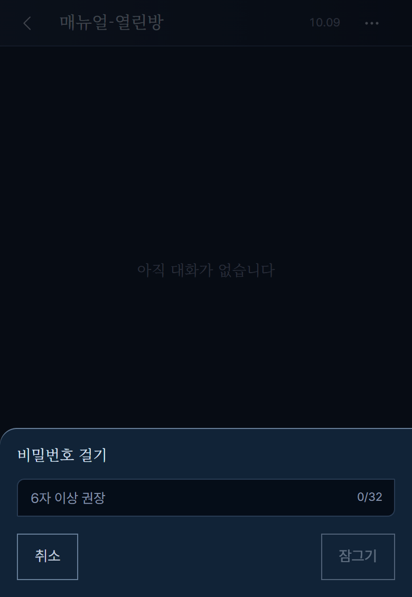

2. 비밀번호를 적습니다. **4~32자**이고 적는 글자는 점으로 가려지며 오른쪽에 글자 수가 나옵니다. 짧으면 알아맞히기 쉬우니 6자 이상을 권합니다.

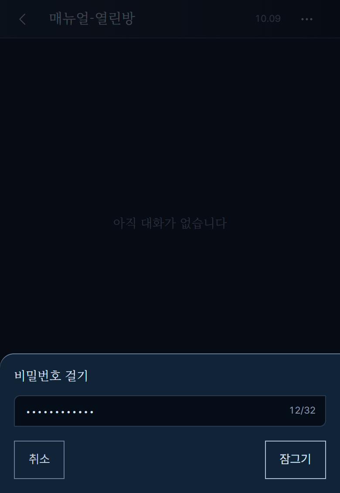

3. 「잠그기」를 누르거나 Enter를 누릅니다(그만두려면 「취소」 또는 Esc). 저장 중에는 창이 잠깁니다.
4. 잠기면 "방을 잠갔습니다." 안내가 잠깐 나옵니다. 방 목록에는 이 방이 자물쇠 표시로 나옵니다(방 목록 매뉴얼 참고).

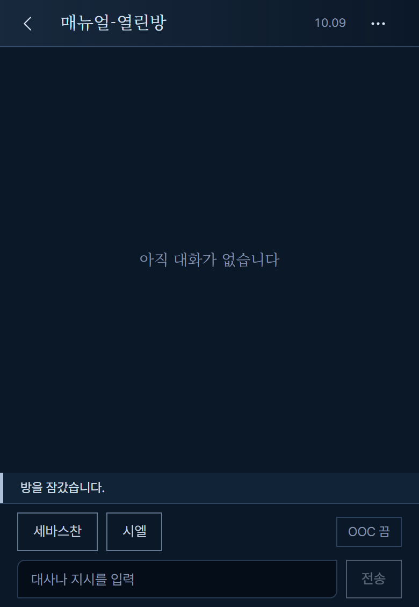

**바꾸기·풀기** : 이미 잠긴 방에서 ⋯ → 「잠금」을 고르면 이름이 「잠금 · 방 이름」인 메뉴가 나옵니다. 항목은 「비밀번호 바꾸기」「잠금 풀기」「취소」입니다.

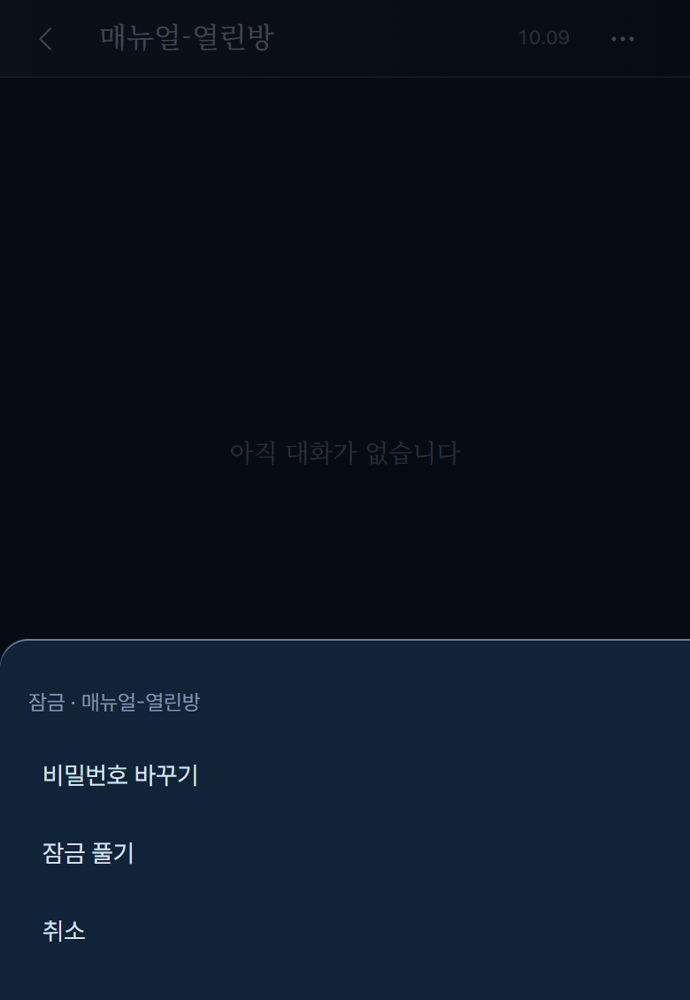

- **비밀번호 바꾸기** : "비밀번호 바꾸기" 창에서 새 비밀번호(4~32자)를 적고 「바꾸기」를 누릅니다. "비밀번호를 바꿨습니다." 안내가 나옵니다. 바꾸면 **이전 비밀번호로 들어와 있던 다른 사람들은 다시 비밀번호를 넣어야 합니다.**

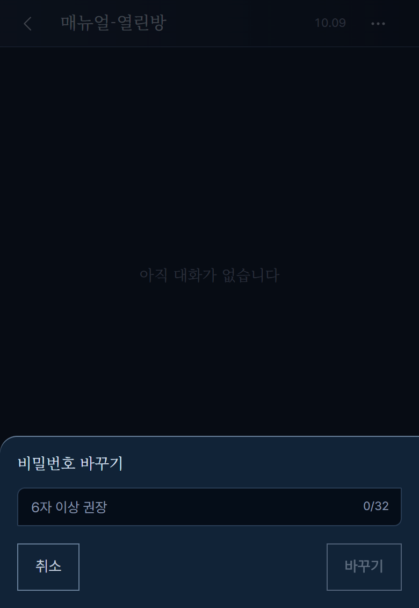

- **잠금 풀기** : "잠금을 풀까요? 잠금을 풀면 누구나 이 방 대화를 볼 수 있습니다." 확인창이 나옵니다. 「풀기」를 누르면 "잠금을 풀었습니다." 안내와 함께 누구나 볼 수 있는 방이 됩니다. 그만두려면 「취소」를 누릅니다.

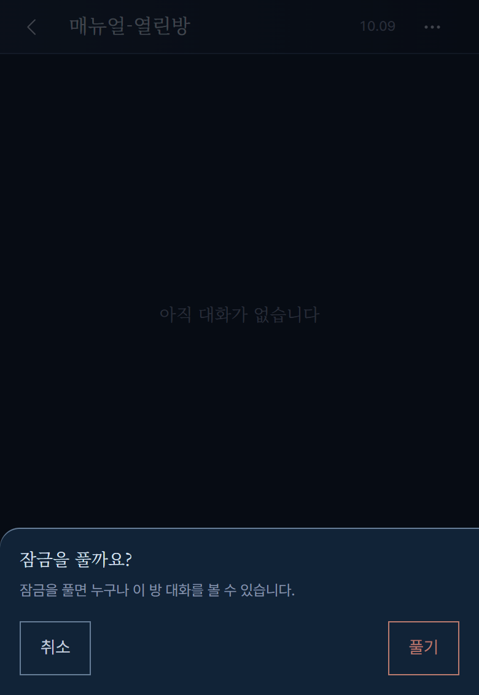

**걸기·바꾸기가 안 될 때** (창 안에 안내가 나옵니다)

| 상황 | 안내 |
|---|---|
| 4자 미만이거나 32자 초과 | 비밀번호는 4~32자로 입력해 주세요. |
| 너무 자주 눌렀음 | 요청이 너무 많습니다. N초 후 다시 시도해 주세요. |
| 연결 문제 | 서버에 연결할 수 없습니다. |
| 그 사이 방이 지워짐 | 방을 찾을 수 없습니다. 목록으로 돌아가 주세요. |

**다른 사람이 바꾸거나 다른 기기에서 바뀌었을 때** : 보고 있는 동안 누군가 비밀번호를 바꾸면(내가 다른 기기에서 바꾼 경우 포함), 다음에 화면이 서버에서 무언가 가져오는 순간 화면에 **「잠긴 방입니다」** 가 나타납니다. 이때 화면은 먼저 기억해 둔 비밀번호로 **조용히 다시 들어가기를 최대 2번** 시도합니다. 그래도 안 되면 아래에서 「비밀번호」 입장 창이 열리니 새 비밀번호를 적고 「입장」을 누르세요. 틀리면 "비밀번호가 맞지 않습니다.", 1분에 5번 넘게 틀리면 "비밀번호를 너무 자주 입력했습니다. N초 후 다시 시도해 주세요."가 나옵니다. 「취소」를 누르면 입장 창만 닫히고 ‹로 목록에 돌아갈 수 있습니다.

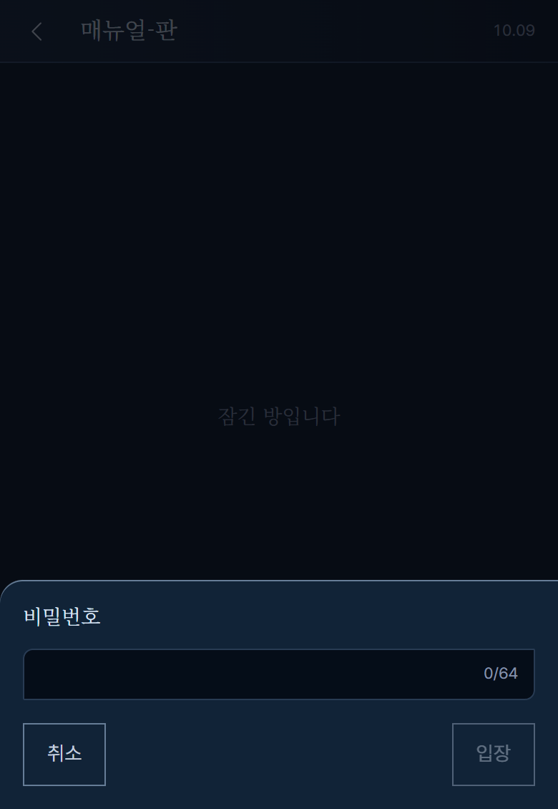

**방문자가 비밀번호로 들어온 모습** : 비밀번호를 아는 방문자는 대화를 읽을 수 있지만 쓰는 도구는 없습니다.

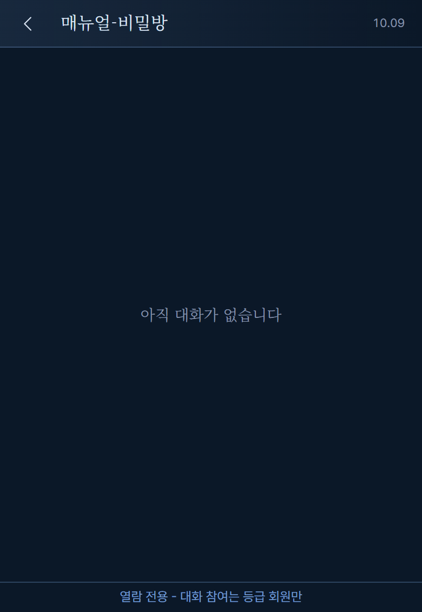

**알아 두기**
- 방을 지우면 그 방의 비밀번호 기억도 함께 사라집니다.
- 한 번 비밀번호를 맞추면 그 브라우저는 그 방을 기억합니다. 다른 기기·브라우저에서는 따로 넣어야 합니다.

## 5. 주의사항

- 대화에 참여할 수 있는 등급은 운영자가 정합니다.
- 「전송」은 글을 올린 **뒤 곧바로 AI에게 답을 만들게 합니다.** 글만 남기는 전송은 없습니다. 답을 만드는 동안은 전송과 캐릭터 버튼이 잠깁니다.
- 답을 만드는 데 시간이 걸립니다. 느린 시간대에는 더 걸릴 수 있습니다.
- 잠금 비밀번호는 서버에 원문이 남지 않아 **잊으면 알려 드릴 수 없습니다.** 관리자가 풀거나, 등급 회원이 새 비밀번호로 덮어쓰세요(4.16). 갠홈 로그인 비밀번호와 다른 것을 쓰세요.
- 삭제한 말풍선과 방은 **되돌릴 수 없습니다.** 방을 지우면 안의 메시지도 함께 지워집니다.
- 말풍선 아래의 「삭제」는 확인창을 한 번 거치지만, 지운 뒤에는 되돌릴 수 없습니다.
- 다른 사람의 글도 수정·삭제할 수 있으니 신중하게 다뤄 주세요.
- 너무 자주 쓰면 잠시 기다리라는 안내가 나옵니다.
- 이전 대화는 위로 밀 때 자동으로 불러옵니다. 실패하면 자동으로 다시 시도하지 않으니 「다시 시도」를 눌러야 합니다.
- 말풍선 글은 그대로 글자로만 보입니다.
- 장기기억 요약은 AI가 만들어 부정확할 수 있습니다. 이상하면 직접 고치세요. 저장하면 이전 요약은 되돌릴 수 없습니다.
- 자동 요약이 막 끝난 직후에 저장하면 내가 저장한 내용이 우선합니다(4.15).

## 6. FAQ

**Q. 왜 입력창이 없나요?**
로그인한 회원 중 등급이 되는 분께만 보입니다. 방문자는 열람만 가능합니다. 로그인이 풀려도 입력창이 사라집니다.

**Q. 세바스찬·시엘 버튼이 안 보여요.**
로그인한 회원 중 등급이 되는 분께만 보입니다. 로그인이 풀렸거나 등급이 맞지 않으면 열람 전용이 되어 사라집니다. 갠홈에서 로그인을 확인하고 패널을 새로 열어 보세요. 버튼이 보이는데 눌리지 않으면 대사를 만드는 중이거나 말풍선을 수정하는 중입니다.

**Q. 왜 시엘(세바스찬)이 답했나요? 나는 다른 캐릭터를 원했어요.**
전송하면 누가 답할지 자동으로 정해집니다. 글에 한쪽 이름만 있으면 그 캐릭터가, 없으면 AI가 고르고, 못 고르면 직전에 말하지 않은 캐릭터가 답합니다. 원하는 캐릭터가 있으면 글에 이름을 넣거나 「세바스찬」「시엘」 버튼을 누르세요. 이미 나온 답이 마음에 들지 않으면 마지막 대사라면 말풍선 아래 「재작성」을 누르면 됩니다(4.11).

**Q. 답이 너무 늦어요.**
보통 10~30초입니다. 누가 답할지 AI가 고르는 데 최대 15초를 쓰고, 그래도 못 고르면 자동 규칙(직전에 말하지 않은 캐릭터)으로 넘어갑니다. 느린 시간대에는 더 걸릴 수 있습니다. 약 1분이 지나도 "…"가 그대로면 ‹로 나갔다 다시 들어오거나 새로 고쳐 주세요.

**Q. 내 이름이 안 보이고 「어떠한 의지」로 나와요.**
정상입니다. 누가 썼든 회원의 발화는 「어떠한 의지」로 보입니다.

**Q. 전송했는데 답이 안 오고 「재시도」가 떴어요.**
내 글은 저장되었습니다. 「재시도」를 누르면 답만 다시 만듭니다.

**Q. 전송이 안 눌려요.**
답을 만드는 중이거나 말풍선을 수정하는 중일 수 있습니다. 답이 올 때까지 기다리세요. 입력창이 비어 있어도 눌리지 않습니다.

**Q. 「수정」「삭제」 버튼이 안 보여요.**
로그인한 회원 중 등급이 되는 분께만 보입니다. 로그인이 풀렸거나 등급이 맞지 않으면 열람 전용이 되어 버튼이 모두 사라집니다. 갠홈에서 로그인을 확인하고 패널을 새로 열어 보세요. 답을 만드는 중인 "…" 말풍선과 실패 안내 말풍선에도 버튼이 없습니다.

**Q. 버튼이 흐리게 보이고 안 눌려요.**
답을 만드는 중이거나 다른 말풍선을 수정하는 중입니다. 끝나면 다시 눌립니다.

**Q. 「재작성」 버튼이 없어요.**
화면 맨 아래의 캐릭터 대사에만 나옵니다. 내 글, 지시, 뒤에 다른 말이 이어진 대사에는 없습니다.

**Q. 말풍선을 길게 눌러도 메뉴가 안 떠요.**
이제 메뉴가 없습니다. 말풍선 바로 아래의 「수정」「삭제」「재작성」 버튼을 누르세요.

**Q. "…"가 안 사라져요.**
대사를 만드는 데 시간이 걸립니다. 보통 10~30초, 길어도 약 1분입니다. 그래도 그대로면 ‹로 나갔다 다시 들어오거나 새로 고쳐 주세요.

**Q. 대사가 두 번 생겼어요.**
"서버에 연결할 수 없습니다."가 뜬 뒤 「재시도」를 누르면, 첫 번째 대사가 실제로는 저장돼 있어 두 개가 될 수 있습니다. 필요 없는 쪽은 말풍선 아래 「삭제」를 눌러 지우세요.

**Q. "서버 설정이 올바르지 않습니다"가 떠요.**
운영 쪽 문제입니다. 운영자에게 알려 주세요.

**Q. 글자 수 제한이 있나요?**
말풍선·지시는 1~2000자, 방 이름은 1~60자입니다.

**Q. 지운 메시지를 되살릴 수 있나요?**
아니요. 삭제는 되돌릴 수 없습니다.

**Q. 오래된 대화는 어떻게 보나요?**
대화 영역을 위로 계속 밀면 이전 대화가 이어서 나옵니다.

**Q. 새로고침하면 어디로 가나요?**
방을 열어 둔 채였다면 그 방으로, 목록으로 돌아온 뒤였다면 목록으로 갑니다.

**Q. 오른쪽 위 날짜는 무슨 날짜인가요?**
방을 만든 날입니다. 목록의 날짜(마지막 갱신일)와 다를 수 있습니다.

**Q. 장기기억 메뉴가 안 보여요.**
로그인한 회원 중 등급이 되는 분께만 ⋯ 버튼과 「장기기억」이 보입니다. 방문자와 로그인이 풀린 경우에는 없습니다.

**Q. 장기기억 요약이 비어 있어요.**
대화가 아직 짧으면 정상입니다. 아직 요약하지 않은 대화가 60개를 넘은 뒤 캐릭터가 말을 마쳐야 자동으로 처음 만들어집니다. 급하면 직접 적어서 저장해도 됩니다.

**Q. 요약이 이상해요.**
AI가 만든 글이라 틀릴 수 있습니다. 입력칸에서 직접 고쳐 「저장」하세요. 저장한 내용이 다음 대사부터 반영됩니다.

**Q. 요약을 지우면 어떻게 되나요?**
입력칸을 모두 지우고 저장하면 요약이 비워집니다. 그러면 다음에 세바스찬이나 시엘이 말한 뒤 AI가 대화를 처음부터 다시 요약합니다(100개씩, 최근 40개는 제외). 요약이 새로 채워질 때까지는 캐릭터가 요약 없이 최근 대화만 보고 말합니다. 비우기 전의 요약은 되돌릴 수 없습니다.

**Q. 고치다가 닫았더니 확인창이 떠요.**
저장하지 않은 내용이 사라진다는 경고입니다. 「계속 고치기」를 누르면 돌아갑니다.

**Q. 「저장」이 안 눌려요.**
내용을 바꾸지 않았거나, 4000자를 넘었거나, 저장 중입니다. 글자 수 표시를 확인하세요.

**Q. 「잠금」 메뉴가 없어요.**
⋯ 메뉴는 로그인한 회원 중 등급이 되는 분께만 보입니다. 방문자에게는 ⋯ 자체가 없습니다. 열람 전용일 때는 잠글 수도 풀 수도 없지만, 비밀번호를 알면 잠긴 방은 읽을 수 있습니다.

**Q. 비밀번호를 잊었어요.**
서버에 원문이 없어 알려 드릴 수 없습니다. 갠홈 관리자에게 잠금을 풀어 달라고 하세요. 이미 그 방에 들어와 있는 등급 회원(예: 아직 기억이 남은 브라우저)은 ⋯ → 「잠금」에서 새 비밀번호로 덮어쓸 수 있습니다. 관리자는 비밀번호 없이 들어와 풀 수 있습니다.

**Q. 잘 보다가 갑자기 「잠긴 방입니다」가 나와요.**
누군가(또는 다른 기기의 내가) 비밀번호를 바꾼 것입니다. 화면이 조용히 두 번까지 다시 들어가 보고, 안 되면 아래 「비밀번호」 창이 열립니다. 새 비밀번호를 넣으세요(4.16).

**Q. 잠긴 방은 목록에 날짜가 안 보여요.**
방 목록에서 잠긴 방은 자물쇠 표시만 있고 날짜는 보여 주지 않도록 되어 있습니다. 고장이 아닙니다. 방 안에 들어오면 위쪽에 날짜가 보입니다.

**Q. 대화가 안 나오고 오류가 떠요.**
「다시 시도」를 눌러 보세요. 계속되면 인터넷 연결을 확인하고 잠시 뒤 다시 열어 보세요.

## 7. 준비 중인 기능

지금은 준비 중인 기능이 없습니다.

## 8. 관련 화면

- 방 목록 화면: `ui/src/rooms/manual.md`

## 9. 변경 이력

| 날짜 | 내용 |
|---|---|
| 2026-10-09 | S6 반영: 방 잠금 4.16(걸기·바꾸기·풀기, 잠긴 방입니다 화면·조용한 재입장), 방 메뉴 5항목, 주의·FAQ 4개, 화면 이미지 10장 추가 |
| 2026-10-07 | 장기기억 요약을 비워서 저장하면 다음 대사 뒤 처음부터 다시 요약(100개씩)한다는 설명으로 4.15·FAQ 개정 |
| 2026-10-07 | S4 반영: 장기기억 보기·고치기(4.15), 자동 요약 설명(60개 초과 시, 최근 40개 유지), 버림 확인, 저장 안내, 주의·FAQ 6개 추가, 방 메뉴 4항목, 준비 중 목록에서 장기기억 제거, 화면 이미지 5장 추가 |
| 2026-10-07 | S3e 반영: 말풍선 아래에 「수정」「삭제」 버튼이 항상 보이고 마지막 캐릭터 대사에는 「재작성」도 보임. 길게 누르기·오른쪽 클릭 메뉴 설명 삭제, 4.7·4.11·FAQ 개정, 화면 이미지 교체 |
| 2026-10-07 | S3d 반영: 전송하면 세바스찬·시엘이 자동으로 답함(4.5), 가운데 "…"·실패·재시도, 작성자 「어떠한 의지」, 답을 만드는 동안 잠금, 실패 안내 보강, FAQ 5개 추가 |
| 2026-10-06 | S3 반영: 세바스찬·시엘 버튼으로 대사 만들기, 생성 중 표시, 실패와 재시도, 재작성(4.9~4.12), FAQ 보강. 장기기억만 준비 중으로 남김 |
