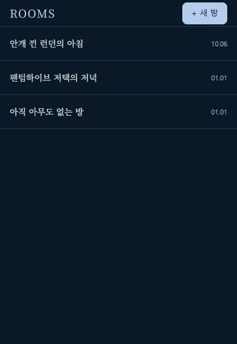
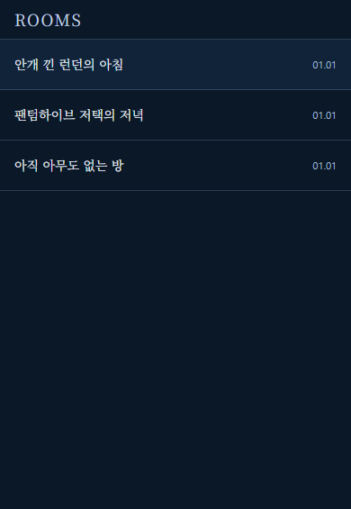
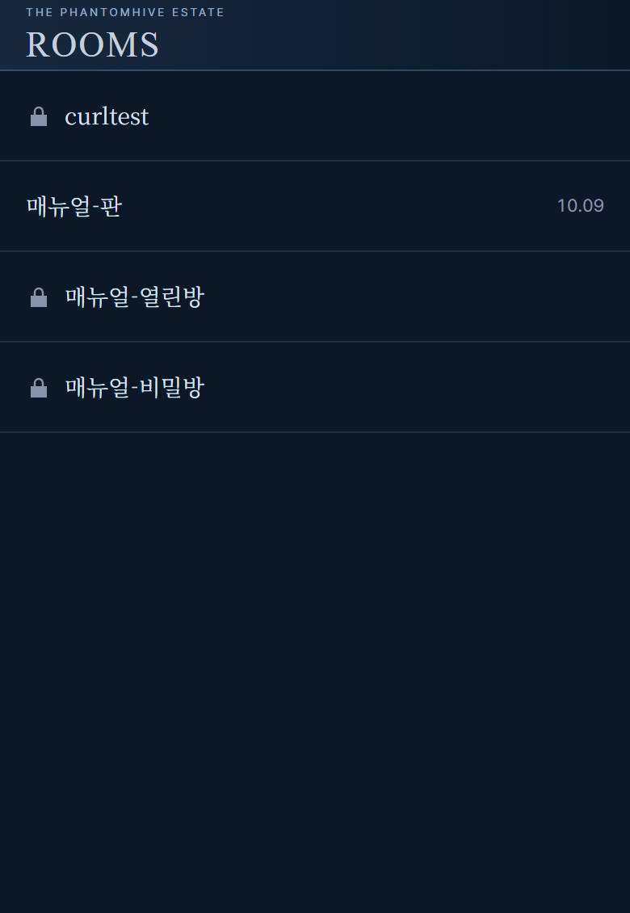
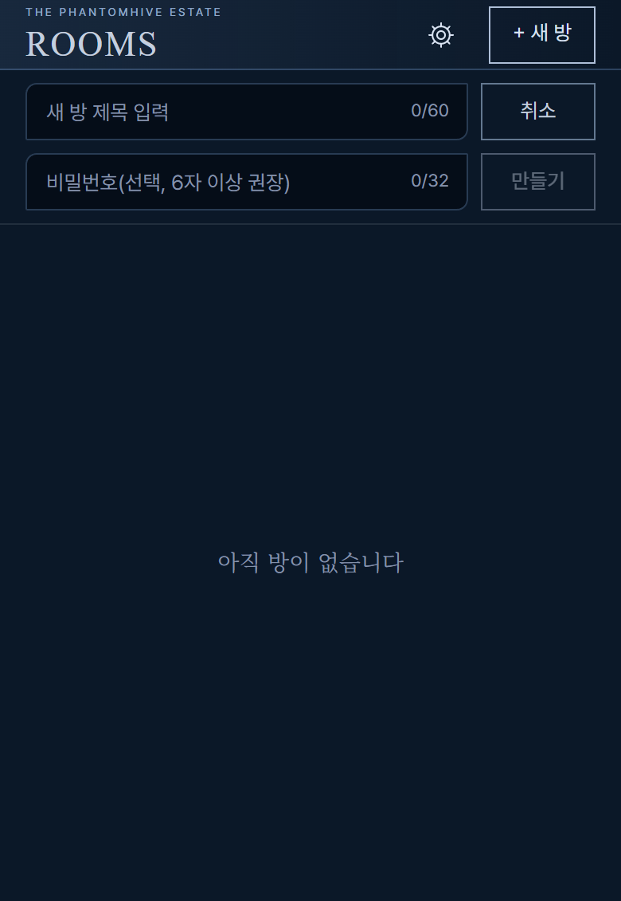
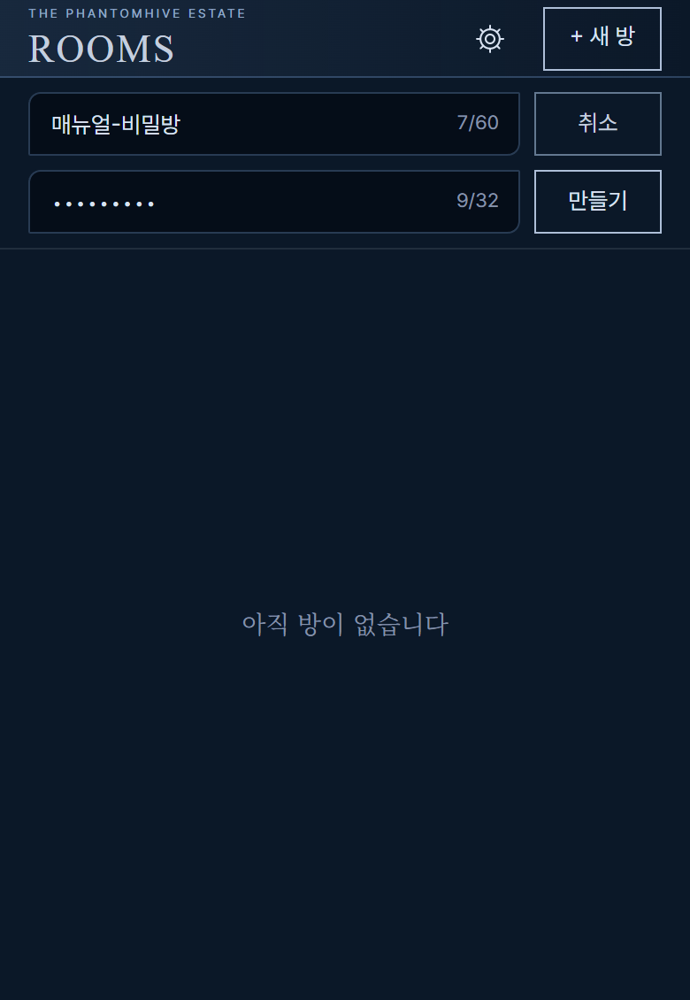
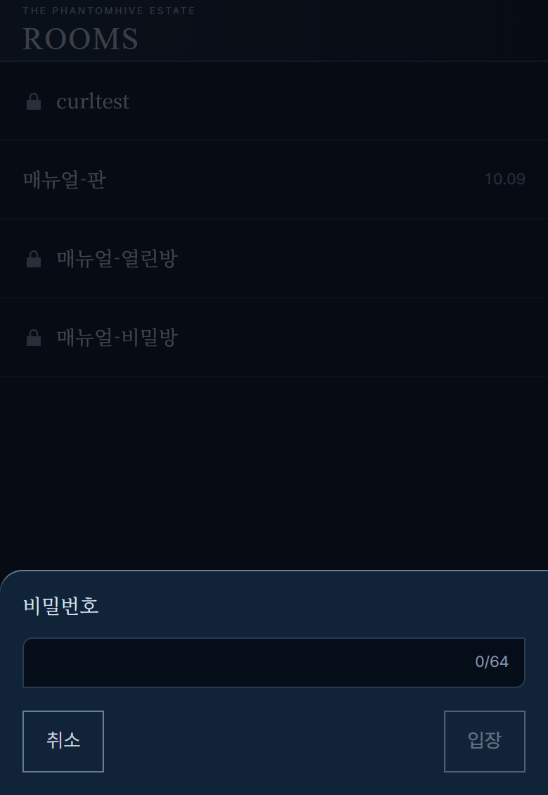
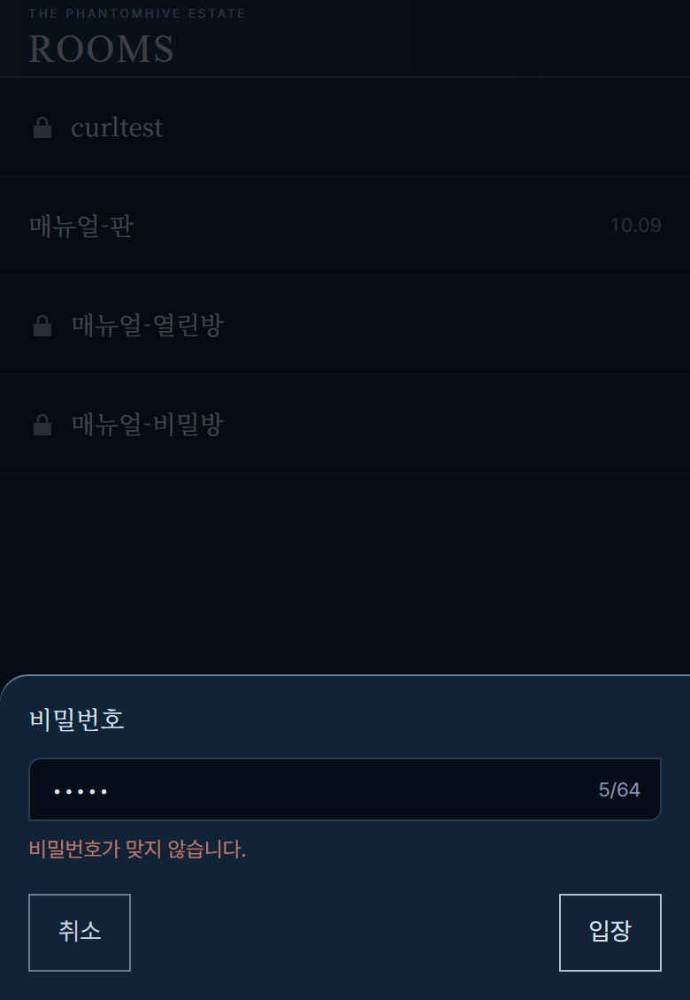

# 방 목록 화면 사용 매뉴얼

## 1. 개요

방 목록은 갠홈 안에서 열리는 **세바스찬·시엘 대화창**의 첫 화면입니다. 지금까지 만들어진 방(대화 묶음)이 최근에 이야기가 오간 순서대로 줄지어 나옵니다. 방을 누르면 그 방의 대화를 볼 수 있습니다.

이 화면은 누가 보느냐에 따라 보이는 것이 달라집니다.

| 보는 사람 | 지금 할 수 있는 것 |
|---|---|
| 로그인한 회원 중 등급이 되는 분 | 패널을 열면 자동으로 쓰기가 가능한 상태가 됩니다. 오른쪽 위에 「+ 새 방」 버튼이 보이고, 새 방을 만들 수 있습니다. |
| 그 외 방문자 | 방 목록과 대화를 읽기만 할 수 있습니다. 「+ 새 방」 버튼은 보이지 않습니다. |

**회원 화면(쓰기 가능)**

**방문자 화면(열람 전용)**

## 2. 진입 경로

1. 갠홈 화면 위쪽(헤더)에서 말풍선 모양 버튼을 누릅니다.
2. 화면 오른쪽에 대화창 패널이 열리고, 첫 화면으로 방 목록이 나타납니다.
3. 목록에서 보고 싶은 방을 누르면 대화 화면으로 넘어갑니다.

등급 회원은 따로 로그인 절차 없이, 패널을 열면 바로 쓰기가 가능합니다.

## 3. 화면 구성

- **맨 위 제목 줄** : 왼쪽에 "ROOMS", 오른쪽에 「+ 새 방」 버튼(등급 회원에게만 보입니다). 주인에게는 그 왼쪽에 톱니바퀴(⚙)도 보입니다.
- **방 줄** : 한 줄이 방 하나입니다. 왼쪽에 방 이름, 오른쪽에 날짜가 있습니다. 비밀번호가 걸린 방은 이름 앞에 자물쇠가 있고 날짜는 보이지 않습니다(7장). 날짜는 그 방에서 마지막으로 이야기가 갱신된 날(월.일)입니다. 이름이 길면 끝이 "…"로 줄어듭니다.
- **배치 순서** : 가장 최근에 갱신된 방이 맨 위에 옵니다.
- **빈 공간** : 방이 몇 개 없으면 아래쪽은 비어 있습니다.

방문자 화면에 「+ 새 방」 버튼이 없는 것은 버그가 아니라 열람 전용이기 때문입니다.

## 4. 기능별 사용법

### 4.1 목록 보기
패널을 열면 자동으로 목록을 불러옵니다. 방이 많아 화면을 넘으면 손가락(또는 마우스 휠)으로 위아래로 밀어 봅니다.

### 4.2 방 열기
보고 싶은 방의 줄을 누릅니다. 키보드를 쓴다면 방 줄로 이동한 뒤 Enter 또는 스페이스를 누릅니다. 대화 화면이 열립니다. 대화 화면 사용법은 `ui/src/chat/manual.md`의 매뉴얼을 보세요.

### 4.3 새 방 만들기 (등급 회원)
1. 오른쪽 위 「+ 새 방」을 누릅니다.
2. 입력 줄이 **두 줄** 나타납니다. 위 칸("새 방 제목 입력")에 제목을 적습니다. 제목은 **1~60자**입니다. 아래 칸은 비밀번호(선택)이며, 비워 두면 누구나 볼 수 있는 방이 됩니다. 비밀번호를 거는 법은 7장을 보세요.
3. 「만들기」를 누르거나 비밀번호 칸에서 Enter를 누릅니다. 제목 칸에서 Enter를 누르면 비밀번호 칸으로 넘어갑니다. 그만두려면 「취소」(또는 Esc)를 누릅니다.
4. 방이 만들어지면 **바로 그 방의 대화 화면으로 들어갑니다.**

만드는 중에는 입력칸이 잠기니 기다려 주세요. 연달아 눌러도 방은 한 번만 만들어집니다.

### 4.4 마지막으로 보던 방 기억
대화를 보다가 패널을 닫았다가 다시 열면, 보던 방이 바로 열립니다. 대화 화면에서 왼쪽 위 뒤로 가기(‹)를 눌러 목록으로 돌아온 뒤 닫았다면, 다음에는 목록에서 시작합니다. 보던 방이 그 사이 없어졌다면 목록에 머뭅니다.

### 4.5 상태별 화면

| 상황 | 화면에 나오는 글 | 하실 일 |
|---|---|---|
| 불러오는 중 | 불러오는 중 | 잠시 기다립니다. |
| 방이 하나도 없음 | 아직 방이 없습니다 | 등급 회원은 「+ 새 방」으로 만들 수 있습니다. 방문자는 기다려 주세요. |
| 불러오기 실패 | 목록을 불러오지 못했습니다 + 이유 + 「다시 시도」 버튼 | 「다시 시도」를 누릅니다. |

실패 이유로는 "서버에 연결할 수 없습니다."처럼 짧은 안내가 함께 나옵니다. 인터넷 연결을 확인한 뒤 「다시 시도」를 누르세요.

### 4.6 방 만들기 실패 안내
방을 만들다 문제가 생기면 화면에 짧은 안내가 잠깐 나타납니다.

| 상황 | 안내 문구 |
|---|---|
| 제목이 비었거나 너무 김 | 방 제목은 1~60자로 입력해 주세요. |
| 너무 자주 눌렀음 | 요청이 너무 많습니다. N초 후 다시 시도해 주세요. (N은 기다릴 시간) |
| 연결 문제 | 서버에 연결할 수 없습니다. |
| 로그인 정보가 없거나 만료됨 | 로그인 정보가 없어 열람 전용으로 바뀌었습니다. / 인증이 만료되어 열람 전용으로 바뀌었습니다. 새로 고쳐 주세요. |
| 등급이 맞지 않음 | 대화 참여 등급이 아니어서 열람 전용으로 바뀌었습니다. |

로그인 관련 안내가 나오면 화면이 열람 전용으로 바뀌고 「+ 새 방」이 사라집니다. 갠홈에서 다시 로그인한 뒤 패널을 새로 열어 주세요.

### 4.7 캐릭터 설정 열기 (갠홈 주인 전용)
갠홈 **주인**으로 열었을 때만 제목 줄의 「+ 새 방」 왼쪽에 톱니바퀴(⚙) 버튼이 보입니다. 누르면 세바스찬·시엘의 세계관·성격·말투를 고치는 캐릭터 설정 화면이 열립니다. 다른 회원과 방문자에게는 이 버튼이 없습니다. 사용법은 `ui/src/settings/manual.md`를 보세요.

## 5. 주의사항

- 대화에 참여할 수 있는 회원 등급은 운영자가 정합니다.
- 너무 자주 방을 만들면 잠시 기다리라는 안내가 나옵니다.
- 목록의 날짜는 만든 날이 아니라 마지막 갱신일입니다.
- 방 이름 변경, 방 삭제, 방 잠금은 대화 화면의 오른쪽 위 메뉴(⋯)에서 합니다.
- 방 비밀번호는 서버에 원문으로 저장되지 않습니다. 잊으면 알려 드릴 수 없습니다. 갠홈 관리자가 풀어 주거나, 이미 들어와 있는 등급 회원이 새 비밀번호로 덮어쓸 수 있습니다.
- 방 비밀번호는 갠홈 로그인 비밀번호와 다릅니다. 같은 것을 쓰지 마세요.

## 6. FAQ

**Q. 새로고침하면 어디로 가나요?**
보던 방이 있으면 그 방으로, 목록에서 나왔다면 목록으로 갑니다.

**Q. 왜 「+ 새 방」 버튼이 없나요?**
로그인한 회원 중 등급이 되는 분께만 보입니다. 방문자이거나 등급이 부족하면 열람만 가능합니다. 등급 기준은 운영자가 정합니다.

**Q. 방 제목에 글자 수 제한이 있나요?**
네, 1~60자입니다.

**Q. 목록이 안 나와요.**
"목록을 불러오지 못했습니다"가 보이면 「다시 시도」를 누르세요. 아무 글도 없이 비어 있으면 "아직 방이 없습니다"를 확인합니다.

**Q. 방 이름이 끝까지 안 보여요.**
긴 이름은 한 줄로 줄여 보입니다. 방을 열면 위쪽에 이름이 나옵니다.

**Q. 방 이름 옆에 자물쇠가 있어요. 날짜는 왜 안 보이나요?**
비밀번호가 걸린 방이라는 표시입니다. 잠긴 방은 날짜를 보여 주지 않도록 되어 있습니다. 고장이 아닙니다.

**Q. 비밀번호를 잊었어요.**
비밀번호는 서버에 원문이 남지 않아 알려 드릴 수 없습니다. 갠홈 관리자에게 잠금을 풀어 달라고 하세요. 관리자는 비밀번호 없이 들어가 풀 수 있습니다. 이미 그 방에 들어와 있는 등급 회원은 대화 화면 ⋯ 메뉴 「잠금」에서 새 비밀번호로 덮어쓸 수도 있습니다.

**Q. 열람 전용인데 새 방 입력 줄이 안 보여요.**
방문자에게는 「+ 새 방」이 없어 비밀번호 칸도 없습니다. 열람 전용이어도 비밀번호를 알면 잠긴 방은 들어가서 읽을 수 있습니다.

**Q. "너무 자주 입력했습니다"가 나와요.**
같은 방 비밀번호를 1분에 5번 넘게 틀리면 잠시 막힙니다. 안내된 시간 뒤에 다시 하세요.

**Q. 한 번 들어갔는데 다시 비밀번호를 물어요.**
누군가 그 사이 비밀번호를 바꾸거나 풀었다는 뜻입니다. 새 비밀번호를 넣으세요. 다른 브라우저·다른 기기에서는 따로 한 번씩 넣어야 합니다.

**Q. 방을 지우면 되돌릴 수 있나요?**
아니요. 방과 안의 메시지가 모두 지워지고 되돌릴 수 없습니다.

## 7. 방 잠금 (비밀번호가 걸린 방)

방에 비밀번호를 걸어 두면, 비밀번호를 아는 사람만 대화를 볼 수 있습니다. 잠긴 방도 목록에는 보이지만 안은 비밀번호를 넣어야 열립니다.

| 보는 사람 | 할 수 있는 것 |
|---|---|
| 로그인한 회원 중 등급이 되는 분 | 새 방을 만들 때 비밀번호를 함께 정할 수 있습니다(선택). 이미 만든 방에 거는 방법은 대화 화면 매뉴얼(`ui/src/chat/manual.md`)의 「방 잠금」을 보세요. 잠긴 방은 비밀번호를 넣고 들어갑니다. |
| 그 외 방문자 | 비밀번호를 만들 수는 없습니다. 잠긴 방은 비밀번호를 알면 들어가서 읽을 수 있습니다. |
| 갠홈 관리자 | 비밀번호 없이 들어갈 수 있고, 잠금도 풀 수 있습니다. |

### 7.1 잠긴 방 알아보기
잠긴 방은 줄 맨 앞에 **자물쇠 모양**이 있고, 오른쪽의 **날짜가 보이지 않습니다.** 잠기지 않은 방은 이름 오른쪽에 날짜가 있습니다.

### 7.2 새 방을 만들면서 비밀번호 걸기 (등급 회원)
1. 「+ 새 방」을 누르면 입력 줄이 **두 줄**로 나타납니다. 위 칸은 방 제목("새 방 제목 입력"), 아래 칸은 방 비밀번호입니다.

2. 아래 칸의 안내 글은 "비밀번호(선택, 6자 이상 권장)"입니다. 걸고 싶을 때만 적습니다. 비밀번호는 **4~32자**이고, 짧으면 다른 사람이 알아맞히기 쉬우니 6자 이상을 권합니다. 적는 글자는 점(●)으로 가려 보이고 오른쪽에 글자 수가 나옵니다.

3. 제목 칸에서 Enter를 누르면 비밀번호 칸으로 넘어갑니다. 비밀번호 칸에서 Enter를 누르거나 「만들기」를 누르면 방이 만들어지고 바로 그 방으로 들어갑니다.
4. 비밀번호 칸을 비워 두면 잠기지 않은 방이 만들어집니다. 나중에 대화 화면 ⋯ 메뉴의 「잠금」에서 걸 수 있습니다.

### 7.3 잠긴 방 들어가기
1. 목록에서 자물쇠가 있는 방을 누릅니다.
2. 아래에서 「비밀번호」 창이 올라옵니다. 비밀번호를 적고 「입장」을 누릅니다(그만두려면 「취소」).

3. 맞으면 방이 열립니다. **한 번 맞춘 방은 이 브라우저가 기억해 두어서** 다음에는 묻지 않고 바로 들어갑니다. 비밀번호가 바뀌거나 풀리면 기억이 무효가 되어 다시 묻습니다.

### 7.4 입장 창에 나오는 안내

| 상황 | 안내 문구 | 하실 일 |
|---|---|---|
| 비밀번호가 틀림 | 비밀번호가 맞지 않습니다. | 다시 적어 「입장」을 누릅니다. |
| 너무 자주 틀림(1분에 5번까지) | 비밀번호를 너무 자주 입력했습니다. N초 후 다시 시도해 주세요. | 안내된 시간만큼 기다립니다. |
| 연결 문제 | 서버에 연결할 수 없습니다. | 인터넷 연결을 확인하고 다시 누릅니다. |
| 방이 없어짐 | 방을 찾을 수 없다는 안내 | 목록으로 돌아가 새로 고칩니다. 지워진 방입니다. |

## 8. 준비 중인 기능

아래는 아직 사용할 수 없습니다.

- 세바스찬·시엘 버튼으로 대사 뽑기, 말풍선 다시 쓰기
- 방의 장기기억 보기

## 9. 관련 화면

- 대화 화면: `ui/src/chat/manual.md`
- 캐릭터 설정(주인 전용): `ui/src/settings/manual.md`
