# 캐릭터 설정 화면 사용 매뉴얼

## 1. 개요

캐릭터 설정은 **세바스찬·시엘이 어떤 사람처럼 말할지**를 적어 두는 화면입니다. 세계관(이야기의 배경)과 두 캐릭터의 성격·말투·규칙을 고치고, 대사를 만드는 **AI 모델(Pro·Flash)**을 고를 수 있습니다. 저장한 내용은 **바로 다음 대사부터** 캐릭터에게 반영됩니다.

이 화면은 **갠홈 주인만** 열 수 있습니다. 다른 회원이나 방문자에게는 들어가는 버튼 자체가 보이지 않습니다. 설정이 바뀌면 모두의 대화에 영향을 주기 때문입니다.

| 보는 사람 | 캐릭터 설정 |
|---|---|
| 갠홈 주인 | 방 목록 위쪽에 톱니바퀴(⚙) 버튼이 보이고, 눌러서 설정을 고칠 수 있습니다. |
| 다른 회원, 방문자 | 버튼이 없습니다. 열 수 없습니다. |

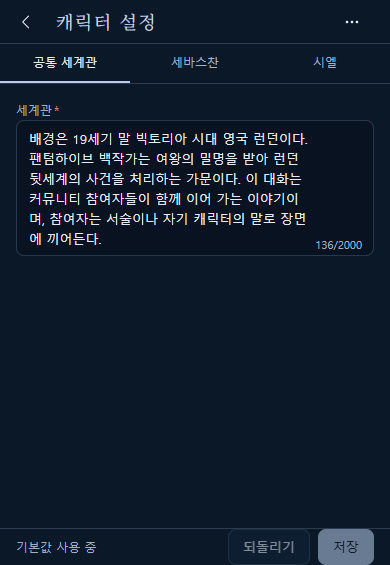

## 2. 진입 경로

1. 갠홈 위쪽(헤더)의 말풍선 버튼을 눌러 대화창 패널을 엽니다.
2. 방 목록 맨 위 줄에서 「+ 새 방」 왼쪽의 톱니바퀴(⚙)를 누릅니다. 안내 이름은 "캐릭터 설정"입니다.
3. 캐릭터 설정 화면이 열립니다.
4. 나갈 때는 왼쪽 위 뒤로 가기(‹)를 누르면 방 목록으로 돌아갑니다.

**주인으로 열었을 때 (⚙가 보입니다)**

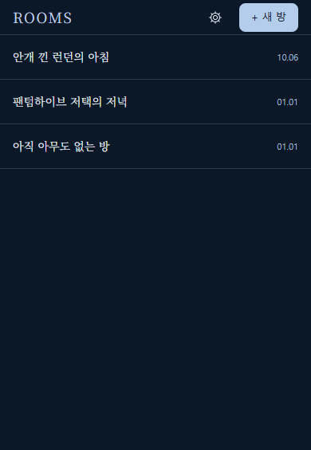

**다른 회원으로 열었을 때 (⚙가 없습니다)**

## 3. 화면 구성

- **맨 위 제목 줄** : 왼쪽에 뒤로 가기(‹), 가운데에 "캐릭터 설정", 오른쪽에 점 세 개(⋯) 메뉴(설정 파일).
- **탭 3개** : 「공통」 「세바스찬」 「시엘」. 누르면 해당 입력칸이 나옵니다. 탭 옆에 "!"가 붙으면 그 탭에 고칠 곳이 있다는 뜻입니다.
- **입력칸** : 항목 이름 아래에 칸이 있고, 칸 오른쪽 아래에 글자 수(예: 136/2000)가 보입니다. 이름 옆 빨간 별(*)은 **꼭 채워야 하는 칸**입니다.
- **맨 아래 줄** : 왼쪽에 지금 상태, 오른쪽에 「되돌리기」와 「저장」 버튼이 있습니다.

맨 아래 줄 왼쪽 글은 이렇게 바뀝니다.

| 글 | 뜻 |
|---|---|
| 기본값 사용 중 | 아직 한 번도 저장하지 않았습니다. 처음 준비된 설정을 쓰고 있습니다. |
| 저장하지 않은 변경 있음 | 고친 곳이 있는데 아직 저장하지 않았습니다. |
| v숫자 저장됨 월.일 시:분 | 마지막으로 저장한 때입니다. 저장할 때마다 숫자가 하나씩 올라갑니다. |
| 저장 중... | 저장하는 중입니다. 잠시 기다립니다. |
| 인증 만료 | 로그인 시간이 지났습니다. 6장을 보세요. |

## 4. 입력칸의 뜻

### 4.1 공통

「공통」 탭 맨 위에는 **AI 모델** 고르기(5.7 참고)가 있고, 그 아래에 **세계관** 칸이 있습니다. 두 캐릭터가 함께 알고 있는 이야기의 배경을 적습니다. 세계관은 꼭 채워야 하며 2000자까지 쓸 수 있습니다.

### 4.2 세바스찬·시엘

두 탭의 입력칸은 같습니다. 세 묶음으로 나뉩니다.

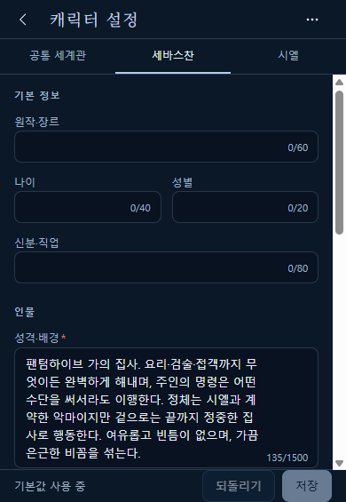

| 묶음 | 항목 | 쓰는 내용 | 글자 수 |
|---|---|---|---|
| 기본 정보 | 원작·장르 | 어느 작품·장르의 인물인지 | 60자 |
| | 나이 | 나이 | 40자 |
| | 성별 | 성별 | 20자 |
| | 신분·직업 | 신분이나 직업 | 80자 |
| 인물 | **성격·배경 \*** | 어떤 성격이고 어떤 사연이 있는지 | 1500자 |
| | 성격 태그 | 성격을 나타내는 짧은 말들 | 200자 |
| | 외형 | 겉모습 | 800자 |
| | 관계 메모 | 다른 사람과의 관계 | 800자 |
| 말투·규칙 | **말투 \*** | 어떤 말투로 말하는지 | 800자 |
| | 샘플 대사 | 말투를 보여 주는 예시 대사 | 한 줄에 하나, 10줄까지, 한 줄 200자 |
| | 규칙·금기 | 지켜야 할 것, 하면 안 되는 것 | 한 줄에 하나, 20줄까지, 한 줄 200자 |

- 「샘플 대사」와 「규칙·금기」는 **줄을 바꿔 가며 하나씩** 적습니다. 오른쪽 아래에 "2/20줄"처럼 줄 수가 보입니다.
- 별(*)이 있는 「성격·배경」과 「말투」는 비워 둘 수 없습니다. 나머지는 비워도 됩니다.
- 글자 수를 넘으면 숫자가 빨갛게 바뀝니다.

## 5. 기능별 사용법

### 5.1 고치고 저장하기

1. 탭을 고르고 입력칸의 글을 고칩니다.
2. 맨 아래 줄에 "저장하지 않은 변경 있음"이 나타나고 「저장」 버튼이 눌리게 됩니다.
3. 「저장」을 누릅니다. 잠깐 "저장 중..."이 보인 뒤 "저장했습니다. 다음 대사부터 반영됩니다."라는 안내가 나옵니다.

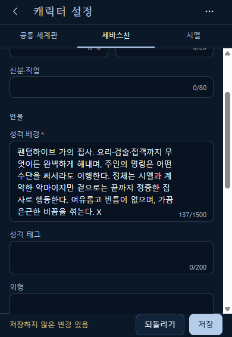

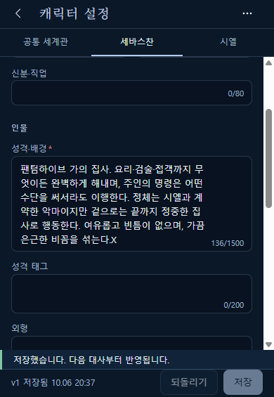

저장한 설정은 **바로 다음에 뽑는 대사부터** 적용됩니다. 이미 나온 말풍선은 바뀌지 않습니다.

### 5.2 저장이 안 눌릴 때

「저장」이 흐리게 보여 눌리지 않는 경우는 세 가지입니다.

| 이유 | 화면에 보이는 것 | 하실 일 |
|---|---|---|
| 바뀐 곳이 없음 | "기본값 사용 중" 또는 "v숫자 저장됨" | 입력칸을 고치면 눌리게 됩니다. |
| 글자 수·줄 수를 넘음 | 칸 아래에 "N자 이하로 줄여 주세요." 등 | 안내대로 줄입니다. |
| 꼭 채울 칸이 비어 있음 | 칸 아래 "필수 항목입니다." | 칸을 채웁니다. |

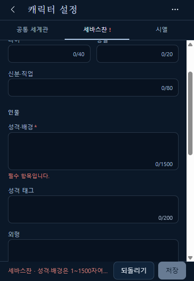

문제가 있는 탭에는 이름 옆에 "!"가 붙고, 맨 아래 줄에도 어느 항목이 문제인지 짧게 나옵니다.

### 5.3 되돌리기

고친 내용이 마음에 들지 않으면 「되돌리기」를 누릅니다. **마지막으로 저장한 상태**로 돌아갑니다. 고른 AI 모델도 함께 원래대로 돌아갑니다. 저장한 적이 없으면 처음 준비된 설정으로 돌아갑니다.

### 5.4 설정 파일 내보내기

설정을 파일로 보관해 둘 수 있습니다. 설정을 크게 고치기 전에 해 두면 안심입니다.

1. 오른쪽 위 점 세 개(⋯)를 누릅니다.
2. 「설정 파일」 메뉴에서 「내보내기」를 고릅니다.
3. 설정 내용이 글로 나옵니다. 「파일로 저장」을 누르면 파일이 내려받아집니다. 파일 이름은 `london-dispatch-characters-날짜-시각.json` 모양입니다.
4. 파일 저장이 막히는 환경이면 "파일로 저장하지 못했습니다. 위 글을 복사해 주세요."가 나옵니다. 글 전체를 복사해서 메모장 등에 붙여 두면 됩니다.

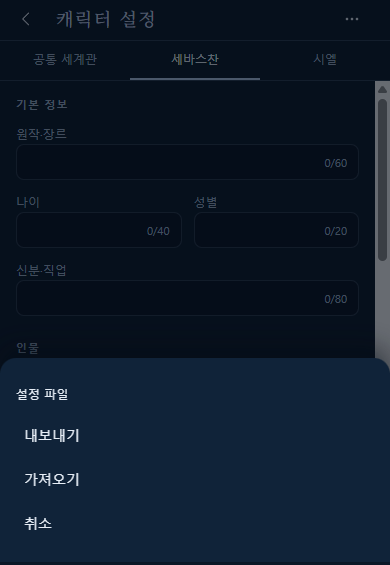

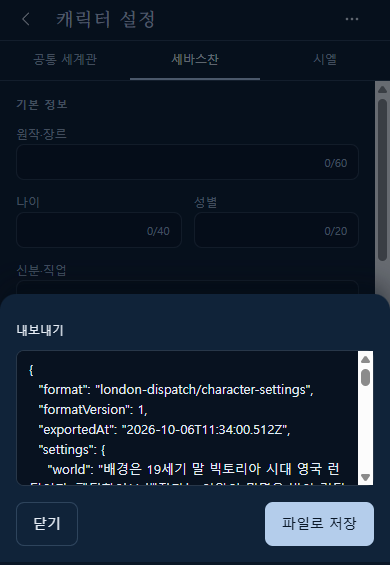

- **저장하지 않은 변경은 내보내는 글에 들어가지 않습니다.** 마지막으로 저장한 내용이 나옵니다. 창 안에도 같은 안내가 있습니다.
- 내보낸 파일에는 **세계관과 두 캐릭터의 설정 글만** 들어갑니다. 비밀번호·열쇠(API 키) 같은 비밀 정보는 절대 들어가지 않으니 안심하고 보관하셔도 됩니다.

### 5.5 설정 파일 가져오기

내보내 둔 파일이나 붙여넣은 글을 읽어 입력칸에 채웁니다.

1. 점 세 개(⋯) → 「가져오기」를 누릅니다.
2. 「파일 선택」으로 파일을 고르거나, 아래 칸에 글을 붙여넣습니다.
3. 「불러오기」를 누릅니다.

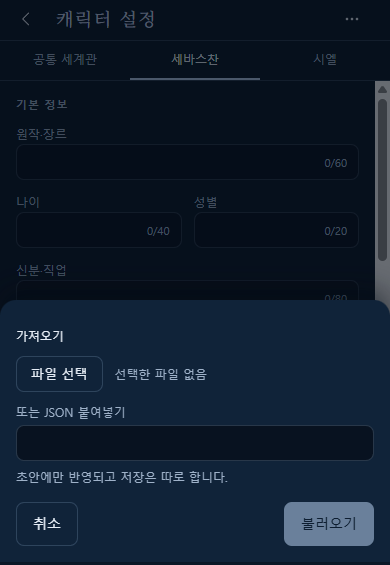

성공하면 "가져왔습니다(공통 1·세바스찬 11·시엘 11). 저장해야 반영됩니다."라는 안내가 나옵니다. 괄호 안은 **어느 묶음의 몇 칸이 채워졌는지**입니다.

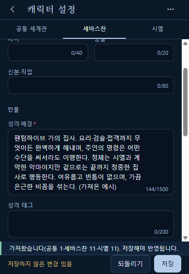

중요한 점이 세 가지 있습니다.

- 가져오기는 **입력칸에만 채워 줍니다. 저장은 따로 눌러야** 합니다. 마음에 안 들면 「되돌리기」로 취소됩니다.
- 이전에 쓰던 **E.No.S 백업 파일도 읽을 수 있습니다.** 세계관과 세바스찬·시엘에 해당하는 칸만 가져옵니다.
- "무시한 항목 N개"는 **형식이 맞지 않는 칸이라서 건너뛴 것**의 수입니다(예: 글이어야 할 칸에 숫자가 들어 있음). 오류가 아니며, 나머지는 정상 반영됩니다.

**통째로 거부되는 경우.** 파일에 틀린 항목이 하나라도 있으면(예: 글자 수 초과, 필수 칸이 빔) **아무것도 반영하지 않고 거부**합니다. 창 안에 이유가 빨간 글로 나옵니다.

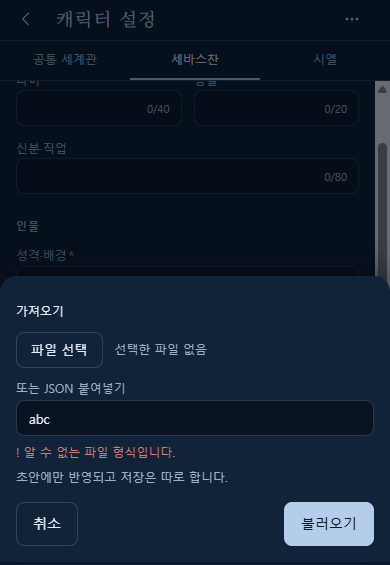

| 거부 안내 | 뜻 |
|---|---|
| 알 수 없는 파일 형식입니다. | 이 화면이나 E.No.S 백업 파일이 아닙니다. |
| 지원하지 않는 파일 버전입니다. | 파일 형식이 너무 새롭거나 오래되었습니다. |
| 세바스찬·시엘이 들어 있는 세계를 찾지 못했습니다. | 백업 안에 두 캐릭터가 없습니다. |
| 파일이 5MB를 넘어 읽지 않았습니다. | 파일이 너무 큽니다. |
| 파일을 읽지 못했습니다. | 파일을 열 수 없었습니다. 다시 골라 보세요. |
| 항목별 안내(예: 세바스찬 · 성격·배경은 1~1500자여야 합니다.) | 그 항목을 고친 뒤 다시 가져옵니다. |

가져올 항목이 하나도 없으면 "가져올 항목이 없습니다."가 나오고 입력칸은 그대로입니다.

### 5.6 고치다가 나가기

고친 내용(AI 모델만 바꾼 경우도 포함)을 저장하지 않고 뒤로 가기(‹)를 누르면 확인 창이 나옵니다.

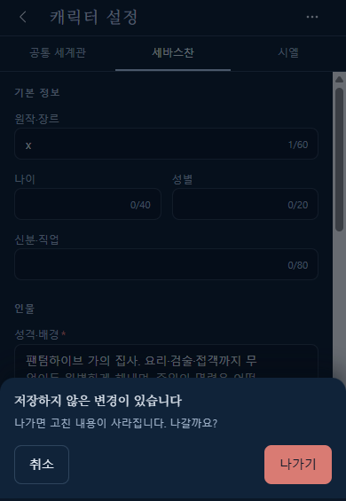

- 「나가기」 : 고친 내용이 사라지고 방 목록으로 돌아갑니다.
- 「취소」 : 계속 고칩니다.

### 5.7 AI 모델 고르기

대사를 만들어 주는 AI를 Pro와 Flash 중에서 고를 수 있습니다. 「공통」 탭 맨 위 「AI 모델」에 있습니다.

| 이름 | 특징 |
|---|---|
| Pro | 더 정교하지만 느리고 비용이 큼 |
| Flash | 빠르고 비용이 적음 |

1. 「공통」 탭을 엽니다. 맨 위 「AI 모델」에서 Pro나 Flash를 누릅니다.
2. 맨 아래 줄이 "저장하지 않은 변경 있음"으로 바뀌고 「되돌리기」와 「저장」이 눌리게 됩니다. 모델만 바꿔도 똑같습니다.
3. 「저장」을 누릅니다. 안내 글처럼 **다음 대답부터** 그 모델을 씁니다. 이미 만들고 있던 대답은 이전 모델로 끝납니다.

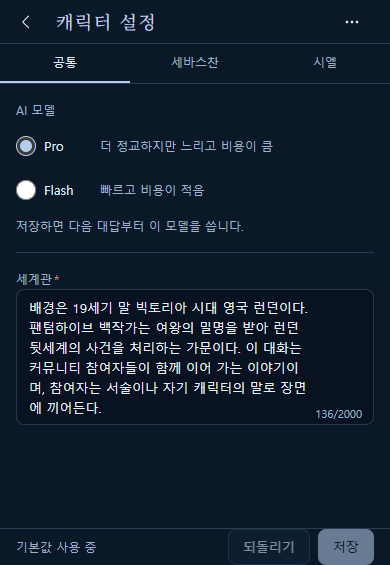

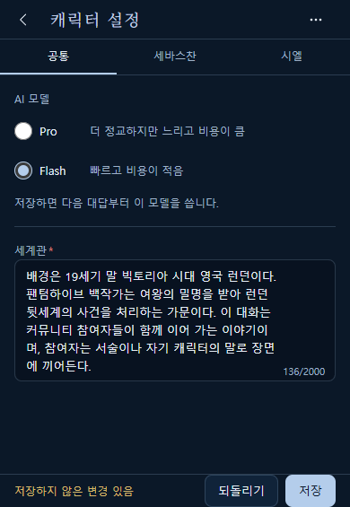

- 「되돌리기」와 나가기 확인(5.6)도 모델 변경에 똑같이 동작합니다.
- 처음 "기본값 사용 중"일 때 **모델만 바꿔 저장해도** 맨 아래 줄이 "v1 저장됨 …"으로 바뀝니다. 정상입니다.
- 모델 이름 옆 가격 숫자는 화면에 나오지 않습니다.
- 아직 모델을 고른 적이 없으면 "아직 고르지 않았습니다. 지금은 서버 기본 모델을 씁니다."가 보입니다. 이때는 운영 쪽에서 정해 둔 기본 모델로 대답합니다. 보통은 보이지 않습니다.

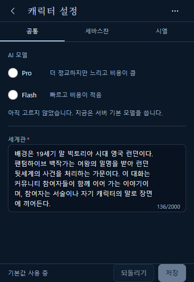

- **내보내기 파일에는 모델이 들어가지 않고, 가져오기로도 모델이 바뀌지 않습니다.** 모델은 이 화면에서 직접 고르고 저장해야 합니다.

## 6. 로그인 시간이 지났을 때

갠홈 로그인에는 시간 제한이 있습니다. 설정을 오래 열어 둔 채 저장을 누르면 시간이 지났을 수 있습니다. 이때는 이렇게 됩니다.

- 아래쪽에 "인증이 만료되었습니다. 내보내기로 변경을 보관한 뒤 새로 고쳐 주세요."가 나오고, 맨 아래 줄에 "인증 만료"가 보입니다.
- **고치던 글은 지워지지 않고 그대로 남아 있습니다.** 다만 저장은 되지 않습니다.
- 「내보내기」는 계속 쓸 수 있습니다. 창에 "인증이 만료되어 현재 초안을 내보냅니다."라고 나오며, 지금 고치던 내용이 파일로 나옵니다.

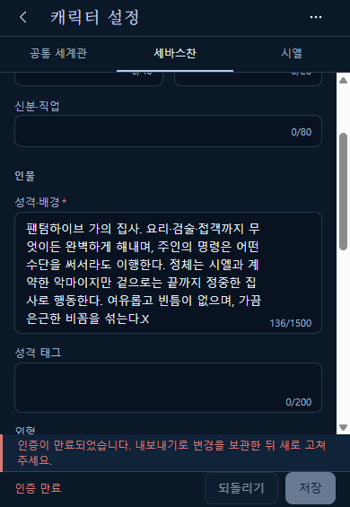

**해결 순서**

1. 점 세 개(⋯) → 「내보내기」로 고친 내용을 파일로 보관합니다.
2. 갠홈에서 대화창을 새로 열거나 새로 고칩니다.
3. 캐릭터 설정을 다시 열고, 보관한 파일을 「가져오기」로 불러옵니다.
4. 「저장」을 누릅니다.

## 7. 주의사항

- 이 화면은 갠홈 주인만 열 수 있습니다. 다른 분께는 버튼이 보이지 않는 것이 정상입니다.
- 저장하면 **모든 대화방**의 다음 대사부터 새 설정이 적용됩니다. 방별로 따로 두지 않습니다.
- **처음 상태로 되돌리는 버튼은 없습니다.** 크게 고치기 전에 「내보내기」로 파일을 보관해 두세요. 되돌리고 싶을 때 그 파일을 「가져오기」로 불러와 저장하면 됩니다.
- 이 화면에서 **고칠 수 없는 것**도 있습니다. 캐릭터의 표시 이름(세바스찬·시엘)과 대사를 만드는 기본 출력 규칙은 정해져 있어서 바꿀 수 없습니다.
- AI 모델은 파일로 보관되지 않습니다. 가져오기를 해도 모델은 그대로이니 필요하면 직접 다시 고르세요.
- 가져오기는 저장이 아닙니다. 가져온 뒤에 「저장」을 눌러야 적용됩니다.
- 내보낸 파일에는 비밀 정보가 들어가지 않지만, 캐릭터 설정 글은 그대로 들어 있으니 보관은 조심해서 해 주세요.

## 8. FAQ

**Q. 톱니바퀴(⚙)가 안 보여요.**
갠홈 주인으로 로그인했을 때만 보입니다. 다른 회원이거나 로그인하지 않았다면 보이지 않는 것이 정상입니다. 주인인데도 안 보이면 갠홈에서 로그인 상태를 확인하고 대화창을 새로 열어 보세요.

**Q. 「저장」 버튼이 눌리지 않아요.**
바뀐 곳이 없거나, 글자 수·줄 수를 넘었거나, 꼭 채울 칸(성격·배경, 말투, 세계관)이 비어 있는 경우입니다. 칸 아래 빨간 안내와 탭의 "!"를 보고 고치세요. 5.2를 참고합니다.

**Q. 가져오기가 거부돼요.**
파일에 틀린 항목이 하나라도 있으면 통째로 거부됩니다. 창에 나온 빨간 글을 보고 파일을 고치거나, 다른 파일을 고르세요. 파일이 아니라 글을 붙여넣었다면 앞뒤가 잘리지 않았는지 확인하세요.

**Q. 내보낸 파일에 API 키가 들어가나요?**
아니요. 세계관과 두 캐릭터의 설정 글만 들어갑니다. 비밀 정보는 들어가지 않습니다.

**Q. 설정을 처음 상태로 되돌리고 싶어요.**
처음으로 되돌리는 버튼은 없습니다. 미리 「내보내기」로 받아 둔 파일이 있으면 「가져오기」로 불러온 뒤 「저장」을 누르세요. 아직 저장한 적이 없다면 「되돌리기」만으로 처음 설정으로 돌아갑니다.

**Q. 저장했는데 이미 나온 말풍선은 안 바뀌어요.**
정상입니다. 새 설정은 저장한 뒤에 뽑는 **다음 대사부터** 반영됩니다.

**Q. Flash로 바꿨는데 왜 지금 대답은 느리죠?**
저장하기 전에 이미 만들고 있던 대답은 이전 모델로 끝나기 때문입니다. 저장한 뒤 **새로 뽑는 대답부터** Flash로 만들어집니다.

**Q. 내보내기·가져오기로 모델도 옮겨지나요?**
아니요. 모델은 파일에 들어가지 않고 가져와도 바뀌지 않습니다. 5.7을 참고합니다.

**Q. "인증 만료"가 떴어요.**
로그인 시간이 지난 것입니다. 고치던 글은 남아 있으니 「내보내기」로 보관하고, 대화창을 새로 연 뒤 「가져오기」로 불러와 저장하세요. 6장을 참고합니다.

**Q. 고치던 중에 실수로 나가면요?**
확인 창이 한 번 나옵니다. 「나가기」를 누르면 고친 내용이 사라집니다.

## 9. 관련 화면

- 방 목록(⚙ 진입): `ui/src/rooms/manual.md`
- 대화 화면: `ui/src/chat/manual.md`

## 10. 문서 이력

| 버전 | 갱신일 | 내용 |
|---|---|---|
| 1.1 | 2026-10-08 | AI 모델 고르기(5.7) 추가, 탭 이름 「공통 세계관」을 「공통」으로 반영, FAQ 2개 추가 |
